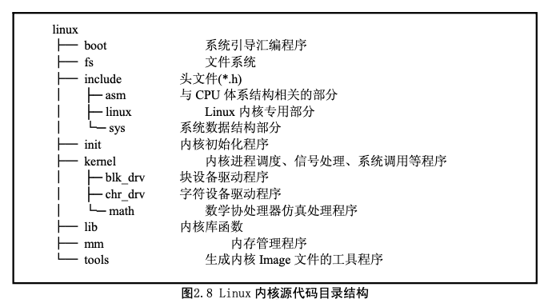
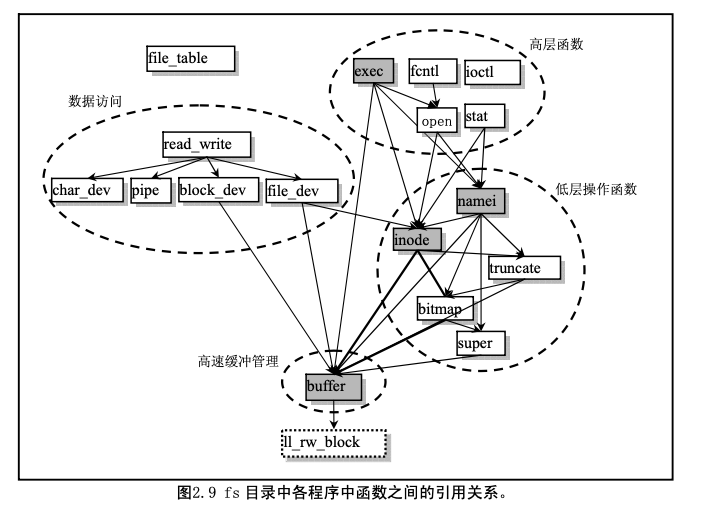
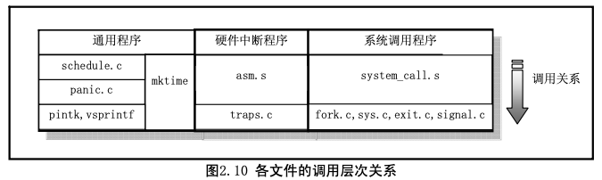
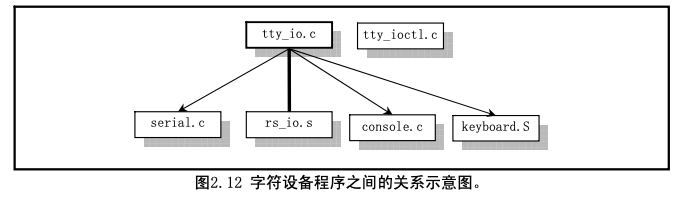

#1.Linux 内核源代码的目录结构

由于 Linux 内核是一种单内核模式的系统，因此，内核中所有的程序几乎都有紧密的联系，它们之间 的依赖和调用关系非常密切。所以在阅读一个源代码文件时往往需要参阅其它相关的文件。因此有必要在 开始阅读内核源代码之前，先熟悉一下源代码文件的目录结构和安排。
这里我们首先列出 Linux 内核完整的源代码目录，包括其中的子目录。然后逐一介绍各个目录中所包 含程序的主要功能，使得整个内核源代码的安排形式能在我们的头脑中建立起一个大概的框架，以便于下 一章开始的源代码阅读工作。
当我们使用 tar 命令将 linux-0.11.tar.gz 解开时，内核源代码文件被放到了 linux 目录中。其中的目录结 构为:

## 2.5.1 内核主目录 linux
linux 目录是源代码的主目录，在该主目录中除了包括所有的 14 个子目录以外，还含有唯一的一个
makefile 文件。该文件是编译辅助工具软件 make 的参数配置文件。make 工具软件的主要用途是通过识别 哪些文件已被修改过，从而自动地决定在一个含有多个源程序文件的程序系统中哪些文件需要被重新编 译。因此，make 工具软件是程序项目的管理软件。
linux 目录下的这个 makefile 文件还嵌套地调用了所有子目录中包含的 makefile 文件，这样，当 linux 目录 (包括子目录)下的任何文件被修改过时，make 都会对其进行重新编译。因此为了编译整个内核所有的 源代码文件，只要在 linux 目录下运行一次 make 软件即可。

##2.5.2 引导启动程序目录 boot
boot 目录中含有 3 个汇编语言文件，是内核源代码文件中最先被编译的程序。这 3 个程序完成的主要
功能是当计算机加电时引导内核启动，将内核代码加载到内存中，并做一些进入 32 位保护运行方式前的 系统初始化工作。其中 bootsect.s 和 setup.s 程序需要使用 as86 软件来编译，使用的是 as86 的汇编语言格式

 (与微软的类似)，而 head.s 需要用 GNU as 来编译，使用的是 AT&T 格式的汇编语言。这两种汇编语言在 下一章的代码注释里以及代码列表后面的说明中会有简单的介绍。
bootsect.s 程序是磁盘引导块程序，编译后会驻留在磁盘的第一个扇区中(引导扇区，0 磁道(柱面)， 0 磁头，第 1 个扇区)。在 PC 机加电 ROM BIOS 自检后，将被 BIOS 加载到内存 0x7C00 处进行执行。
setup.s 程序主要用于读取机器的硬件配置参数，并把内核模块 system 移动到适当的内存位置处。
head.s 程序会被编译连接在 system 模块的最前部分，主要进行硬件设备的探测设置和内存管理页面的 初始设置工作。

##2.5.3 文件系统目录 fs
是文件系统实现程序的目录，共包含 17 个 C 语言程序。这些程序之间的主要引用关系见图 2.9 所示
图中每个方框代表一个文件，从上到下按基本按引用关系放置。其中各文件名均略去了后缀.c，虚框中是 的程序文件不属于文件系统，带箭头的线条表示引用关系，粗线条表示有相互引用关系。

由图可以看出，该目录中的程序可以划分成四个部分:高速缓冲区管理、低层文件操作、文件数据访 问和文件高层函数，在对本目录中文件进行注释说明时，我们也将分成这四个部分来描述。
对于文件系统，我们可以将它看成是内存高速缓冲区的扩展部分。所有对文件系统中数据的访问，都 需要首先读取到高速缓冲区中。本目录中的程序主要用来管理高速缓冲区中缓冲块的使用分配和块设备上 的文件系统。管理高速缓冲区的程序是 buffer.c，而其它程序则主要都是用于文件系统管理。
在 file_table.c 文件中，目前仅定义了一个文件句柄(描述符)结构数组。ioctl.c 文件将引用 kernel/chr_dev/tty.c 中的函数，实现字符设备的 io 控制功能。exec.c 程序主要包含一个执行程序函数 do_execve()，它是所有 exec()函数簇中的主要函数。fcntl.c 程序用于实现文件 i/o 控制的系统调用函数。 read_write.c 程序用于实现文件读/写和定位三个系统调用函数。stat.c 程序中实现了两个获取文件状态的系 统调用函数。open.c 程序主要包含实现修改文件属性和创建与关闭文件的系统调用函数。
char_dev.c 主要包含字符设备读写函数 rw_char()。pipe.c 程序中包含管道读写函数和创建管道的系统 调用。file_dev.c 程序中包含基于 i 节点和描述符结构的文件读写函数。namei.c 程序主要包括文件系统中目 录名和文件名的操作函数和系统调用函数。block_dev.c 程序包含块数据读和写函数。inode.c 程序中包含针 对文件系统 i 节点操作的函数。truncate.c 程序用于在删除文件时释放文件所占用的设备数据空间。

bitmap.c 程序用于处理文件系统中 i 节点和逻辑数据块的位图。super.c 程序中包含对文件系统超级块的处理函数。 buffer.c 程序主要用于对内存高速缓冲区进行处理。虚框中的 ll_rw_block 是块设备的底层读函数，它并不 在 fs 目录中，而是 kernel/blk_dev/ll_rw_block.c 中的块设备读写驱动函数。放在这里只是让我们清楚的看 到，文件系统对于块设备中数据的读写，都需要通过高速缓冲区与块设备的驱动程序(ll_rw_block())来 操作来进行，文件系统程序集本身并不直接与块设备的驱动程序打交道。
在对程序进行注释过程中，我们将另外给出这些文件中各个主要函数之间的调用层次关系。

##2.5.4 头文件主目录 include
头文件目录中总共有 32 个.h 头文件。其中主目录下有 13 个，asm 子目录中有 4 个，linux 子目录中有
10 个，sys 子目录中有 5 个。这些头文件各自的功能见如下简述，具体的作用和所包含的信息请参见对头 文件的注释一章。
a.out 头文件，定义了 a.out 执行文件格式和一些宏。 常数符号头文件，目前仅定义了 i 节点中 i_mode 字段的各标志位。 字符类型头文件。定义了一些有关字符类型判断和转换的宏。 错误号头文件。包含系统中各种出错号。(Linus 从 minix 中引进的)。
<a.out.h>
<const.h>
<ctype.h>
<errno.h>
<fcntl.h>
<signal.h>
<stdarg.h>
宏(va_start, va_arg 和 va_end)，用于 vsprintf、vprintf、vfprintf 函数。
文件控制头文件。用于文件及其描述符的操作控制常数符号的定义。 信号头文件。定义信号符号常量，信号结构以及信号操作函数原型。 标准参数头文件。以宏的形式定义变量参数列表。主要说明了-个类型(va_list)和三个
标准定义头文件。定义了 NULL, offsetof(TYPE, MEMBER)。 字符串头文件。主要定义了一些有关字符串操作的嵌入函数。
<stddef.h>
<string.h>
<termios.h>
<time.h>
<unistd.h>
__LIBRARY__，则还包括系统调用号和内嵌汇编_syscall0()等。
<utime.h> 用户时间头文件。定义了访问和修改时间结构以及 utime()原型。 

###2.5.4.1 体系结构相关头文件子目录 include/asm
这些头文件主要定义了一些与 CPU 体系结构密切相关的数据结构、宏函数和变量。共 4 个文件。 <asm/io.h> io 头文件。以宏的嵌入汇编程序形式定义对 io 端口操作的函数。
<asm/memory.h> 内存拷贝头文件。含有 memcpy()嵌入式汇编宏函数。
<asm/segment.h> 段操作头文件。定义了有关段寄存器操作的嵌入式汇编函数。
<asm/system.h> 系统头文件。定义了设置或修改描述符/中断门等的嵌入式汇编宏。 

###2.5.4.2 Linux 内核专用头文件子目录 include/linux
<linux/config.h> 内核配置头文件。定义键盘语言和硬盘类型(HD_TYPE)可选项。 <linux/fdreg.h> 软驱头文件。含有软盘控制器参数的一些定义。
<linux/fs.h> 文件系统头文件。定义文件表结构(file,buffer_head,m_inode 等)。 <linux/hdreg.h> 硬盘参数头文件。定义访问硬盘寄存器端口，状态码，分区表等信息。 <linux/head.h> head 头文件，定义了段描述符的简单结构，和几个选择符常量。 <linux/kernel.h> 内核头文件。含有一些内核常用函数的原形定义。
<linux/mm.h> <linux/sched.h>
内存管理头文件。含有页面大小定义和一些页面释放函数原型。 调度程序头文件，定义了任务结构 task_struct、初始任务 0 的数据，
还有一些有关描述符参数设置和获取的嵌入式汇编函数宏语句。 系统调用头文件。含有 72 个系统调用 C 函数处理程序,以'sys_'开头。
tty 头文件，定义了有关 tty_io，串行通信方面的参数、常数。
终端输入输出函数头文件。主要定义控制异步通信口的终端接口。 时间类型头文件。其中最主要定义了 tm 结构和一些有关时间的函数原形。
Linux 标准头文件。定义了各种符号常数和类型，并申明了各种函数。如定义了
<linux/sys.h>
<linux/tty.h>
###2.5.4.3 系统专用数据结构子目录 include/sys
<sys/stat.h>
<sys/times.h>
<sys/types.h>
<sys/utsname.h> 系统名称结构头文件。
<sys/wait.h> 等待调用头文件。定义系统调用 wait()核 waitpid()及相关常数符号。

##2.5.5 内核初始化程序目录 init
该目录中仅包含一个文件 main.c。用于执行内核所有的初始化工作，然后移到用户模式创建新进程，
并在控制台设备上运行 shell 程序。 程序首先根据机器内存的多少对缓冲区内存容量进行分配，如果还设置了要使用虚拟盘，则在缓冲区
内存后面也为它留下空间。之后就进行所有硬件的初始化工作，包括人工创建第一个任务(task 0)，并设 置了中断允许标志。在执行从核心态移到用户态之后，系统第一次调用创建进程函数 fork()，创建出一个 用于运行 init()的进程，在该子进程中，系统将进行控制台环境设置，并且在生成一个子进程用来运行 shell 程序。

##2.5.6 内核程序主目录 kernel
linux/kernel 目录中共包含 12 个代码文件和一个 Makefile 文件，另外还有 3 个子目录。由于这些文件
中代码之间调用关系复杂，因此这里就不详细列出各文件之间的引用关系图，但仍然可以进行大概分类， 见图 2.10 所示。

asm.s 程序是用于处理系统硬件异常所引起的中断，对各硬件异常的实际处理程序则是在 traps.c 文件 中，在各个中断处理过程中，将分别调用 traps.c 中相应的 C 语言处理函数。
exit.c 程序主要包括用于处理进程终止的系统调用。包含进程释放、会话(进程组)终止和程序退出 处理函数以及杀死进程、终止进程、挂起进程等系统调用函数。
fork.c 程序给出了 sys_fork()系统调用中使用了两个 C 语言函数:find_empty_process()和 copy_process()。
mktime.c 程序包含一个内核使用的时间函数 mktime()，用于计算从 1970 年 1 月 1 日 0 时起到开机当 日的秒数，作为开机秒时间。仅在 init/main.c 中被调用一次。
panic.程序包含一个显示内核出错信息并停机的函数 panic()。
printk.c 程序包含一个内核专用信息显示函数 printk()。
sched.c 程序中包括有关调度的基本函数(sleep_on、wakeup、schedule 等)以及一些简单的系统调用函数。
另外还有几个与定时相关的软盘操作函数。
signal.c 程序中包括了有关信号处理的 4 个系统调用以及一个在对应的中断处理程序中处理信号的函
数 do_signal()。
sys.c 程序包括很多系统调用函数，其中有些还没有实现。 system_call.s程序实现了linux系统调用(int 0x80)的接口处理过程，实际的处理过程则包含在各系
统调用相应的 C 语言处理函数中，这些处理函数分布在整个 linux 内核代码中。 vsprintf.c 程序实现了现在已经归入标准库函数中的字符串格式化函数。

###2.5.6.1 块设备驱动程序子目录 kernel/blk_dev 
通常情况下，用户是通过文件系统来访问设备的，因此设备驱动程序为文件系统实现了调用接口。在
使用块设备时，由于其数据吞吐量大，为了能够高效率地使用块设备上的数据，在用户进程与块设备之间 使用了高速缓冲机制。在访问块设备上的数据时，系统首先以数据块的形式把块设备上的数据读入到高速 缓冲区中，然后再提供给用户。blk_dev 子目录共包含 4 个 c 文件和 1 个头文件。头文件 blk.h 由于是块设 备程序专用的，所以与 C 文件放在一起。这几个文件之间的大致关系，见图 2.11 所示。

blk.h 中定义了 3 个 C 程序中共用的块设备结构和数据块请求结构。hd.c 程序主要实现对硬盘数据块进 行读/写的底层驱动函数，主要是 do_hd__request()函数;floppy.c 程序中主要实现了对软盘数据块的读/写驱 动函数，主要是 do_fd_request()函数。ll_rw_blk.c 中程序实现了低层块设备数据读/写函数 ll_rw_block()， 内核中所有其它程序都是通过该函数对块设备进行数据读写操作。你将看到该函数在许多访问块设备数据 的地方被调用，尤其是在高速缓冲区处理文件 fs/buffer.c 中。

###2.5.6.2 字符设备驱动程序子目录 kernel/chr_dev
字符设备程序子目录共含有 4 个 C 语言程序和 2 个汇编程序文件。这些文件实现了对串行端口 rs-232、
串行终端、键盘和控制台终端设备的驱动。下图(图 2.12)是这些文件之间的大致调用层次关系。

tty_io.c 程序中包含 tty 字符设备读函数 tty_read()和写函数 tty_write()，为文件系统提供了上层访问接 口。另外还包括在串行中断处理过程中调用的 C 函数 do_tty_interrupt()，该函数将会在中断类型为读字符 的处理中被调用。
console.c 文件主要包含控制台初始化程序和控制台写函数 con_write()，用于被 tty 设备调用。还包含 对显示器和键盘中断的初始化设置程序 con_init()。
rs_io.s 汇编程序用于实现两个串行接口的中断处理程序。该中断处理程序会根据从中断标识寄存器(端 口 0x3fa 或 0x2fa)中取得的 4 种中断类型分别进行处理，并在处理中断类型为读字符的代码中调用 do_tty_interrupt()。
serial.c 用于对异步串行通信芯片 UART 进行初始化操作，并设置两个通信端口的中断向量。另外还包 括 tty 用于往串口输出的 rs_write()函数。
tty_ioctl.c 程序实现了 tty 的 io 控制接口函数 tty_ioctl()以及对 termio(s)终端 io 结构的读写函数，并会 在实现系统调用 sys_ioctl()的 fs/ioctl.c 程序中被调用。
keyboard.S 程序主要实现了键盘中断处理过程 keyboard_interrupt。

###2.5.6.3 协处理器仿真和操作程序子目录 kernel/math
该子目录中目前仅有一个 C 程序 math_emulate.c。其中的 math_emulate()函数是中断 int7 的中断处理 程序调用的 C 函数。当机器中没有数学协处理器，而 CPU 却又执行了协处理器的指令时，就会引发该中 断。因此，使用该中断就可以用软件来仿真协处理器的功能。本书所讨论的内核版本还没有包含有关协处 理器的仿真代码。本程序中只是打印一条出错信息，并向用户程序发送一个协处理器错误信号 SIGFPE。

##2.5.7 内核库函数目录 lib 
内核库函数主要用于用户编程调用，是编译系统标准库的接口函数之一。其中共有 12 个 C 语言文件，
除了一个由 tytso 编制的 malloc.c 程序较长以外，其它的程序很短，有的只有一二行代码。 
 这些文件中主要包括有退出函数_exit()、关闭文件函数 close(fd)、复制文件描述符函数 dup()、文件打开函 数 open()、写文件函数 write()、执行程序函数 execve()、内存分配函数 malloc()、等待子进程状态函数 wait()、 创建会话系统调用 setsid()以及在 include/string.h 中实现的所有字符串操作函数。

##2.5.8 内存管理程序目录 mm
该目录包括 2 个代码文件。主要用于管理程序对主内存区的使用，实现了进程逻辑地址到线性地址以
及线性地址到主内存区中物理内存地址的映射，通过内存的分页管理机制，在进程的虚拟内存页与主内存 区的物理内存页之间建立了对应关系。
page.s 文件包括内存页面异常中断(int 14)处理程序，主要用于处理程序由于缺页而引起的页异常中 断和访问非法地址而引起的页保护。
memory.c 程序包括对内存进行初始化的函数 mem_init()，由 page.s 的内存处理中断过程调用的 do_no_page()和 do_wp_page()函数。在创建新进程而执行复制进程操作时，即使用该文件中的内存处理函 数来分配管理内存空间。

##2.5.9 编译内核工具程序目录 tools
该目录下的 build.c 程序用于将 Linux 各个目录中被分别编译生成的目标代码连接合并成一个可运行的
内核映象文件 image。其具体的功能可参见下一章内容。

