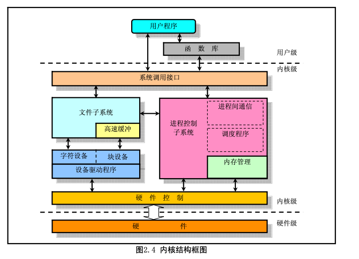
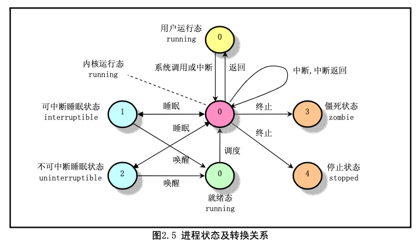
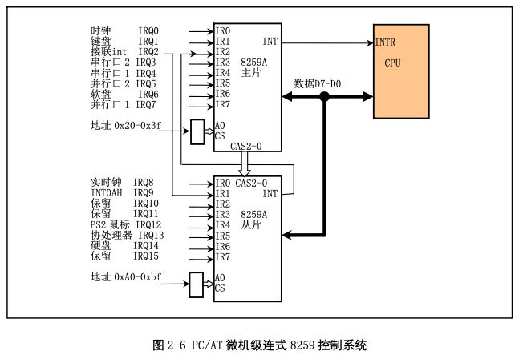

#1.Linux 内核系统体系结构

若从单内核模式结构模型出发，我们还可以根据linux 0.11内核源代码的结构将内核主要模块绘制成 图 2.4 所示的框图结构。

其中内核级中的几个方框，除了硬件控制方框以外，其它粗线方框分别对应内核源代码的目录组织结 构。
除了这些图中已经给出的依赖关系以外，所有这些模块还会依赖于内核中的通用资源。这些资源包括 内核所有子系统都会调用的内存分配和收回函数、打印警告或出错信息函数以及一些系统调试函数。

#2.内核进程状态

当进程正在被 CPU 执行时，被称为处于执行状态(running)。当进程正在等待系统中的资源而处于等 待状态时，则称其处于睡眠等待状态。在 linux 系统中，还分为可中断的和不可中断的等待状态。当系统 资源已经可用时，进程就被唤醒而进入准备运行状态，该状态称为就绪态。当进程已停止运行，但其父进 程还没有询问其状态时，则称该进程处于僵死状态。当进程被终止时，称其处于停止状态。
只有当进程从“内核运行态”转移到“睡眠状态”时，内核才会进行进程切换操作。在内核态下运行 的进程不能被其它进程抢占，而且一个进程不能改变另一个进程的状态。为了避免进程切换时造成内核数 据错误，内核在执行临界区代码时会禁止一切中断。

#3.中断机制

对于Linux内核，中断信号通常分为两类：硬件中断和软件中断（异常）。每个中断是由0~255之间的一个数字来标识。
对于中断int0 ~ int31（ox00~0x1f），每个中断由intel公司固定设定或者保留，属于软件中断，但intel公司称之为异常。

中断int32~int255(0x20~0xff)可以由用户自己设定。

在Linux系统中，将int32~int47（0x20~0x2f）对应于8259A芯片发出的硬件中断请求信号IRQ0 ~ IRQ15，并把程序编程发出的系统调用（system call)中断设置为 int128（0x80）。

