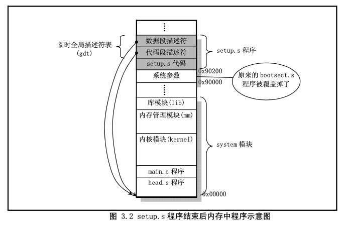

#1.overall

这里先总的说明一下 Linux 操作系统启动部分的主要执行流程。当 PC 的电源打开后，80x86 结构的 CPU 将自动进入实模式，并从地址 0xFFFF0 开始自动执行程序代码，这个地址通常是 ROM-BIOS 中的地 址。PC 机的 BIOS 将执行某些系统的检测，并在物理地址 0 处开始初始化中断向量。此后，它将可启动设 备的第一个扇区(磁盘引导扇区，512 字节)读入内存绝对地址 0x7C00 处，并跳转到这个地方。启动设 备通常是软驱或是硬盘。这里的叙述是非常简单的，但这已经足够理解内核初始化的工作过程了。

Linux 的最最前面部分是用 8086 汇编语言编写的(boot/bootsect.s)，它将由 BIOS 读入到内存绝对地址 0x7C00(31KB)处，当它被执行时就会把自己移到绝对地址 0x90000(576KB)处，并把启动设备中后 2kB 字 节代码(boot/setup.s)读入到内存 0x90200 处，而内核的其它部分(system 模块)则被读入到从地址 0x10000 开始处，因为当时system模块的长度不会超过0x80000字节大小(即512KB)，所以它不会覆盖在0x90000 处开始的 bootsect 和 setup 模块。随后将 system 模块移动到内存起始处，这样 system 模块中代码的地址也 即等于实际的物理地址。便于对内核代码和数据的操作。图 3.1 清晰地显示出 Linux 系统启动时这几个程 序或模块在内存中的动态位置。其中，每一竖条框代表某一时刻内存中各程序的映像位置图。在系统加载 期间将显示信息"Loading..."。然后控制权将传递给 boot/setup.s 中的代码，这是另一个实模式汇编语言程序。


启动部分识别主机的某些特性以及 vga 卡的类型。如果需要，它会要求用户为控制台选择显示模式。 然后将整个系统从地址 0x10000 移至 0x0000 处，进入保护模式并跳转至系统的余下部分(在 0x0000 处)。 此时所有32位运行方式的设置启动被完成: IDT、GDT以及LDT被加载，处理器和协处理器也已确认， 分页工作也设置好了;最终调用 init/main.c 中的 main()程序。上述操作的源代码是在 boot/head.S 中的，这 可能是整个内核中最有诀窍的代码了。注意如果在前述任何一步中出了错，计算机就会死锁。在操作系统 还没有完全运转之前是处理不了出错的。


#2.bootsect.s

##主要流程
bootsect.s 代码是磁盘引导块程序，驻留在磁盘的第一个扇区中(引导扇区，0 磁道(柱面)，0 磁头，
第 1 个扇区)。在 PC 机加电 ROM BIOS 自检后，引导扇区由 BIOS 加载到内存 0x7C00 处，然后将自己移 动到内存 0x90000 处。该程序的主要作用是首先将 setup 模块(由 setup.s 编译成)从磁盘加载到内存，紧 接着 bootsect 的后面位置(0x90200),然后利用 BIOS 中断 0x13 取磁盘参数表中当前启动引导盘的参数， 接着在屏幕上显示“Loading system...”字符串。再者将 system 模块从磁盘上加载到内存 0x10000 开始的地 方。随后确定根文件系统的设备号，若没有指定，则根据所保存的引导盘的每磁道扇区数判别出盘的类型 和种类(是 1.44M A 盘?)并保存其设备号于 root_dev(引导块的 0x508 地址处)，最后长跳转到 setup 程序 的开始处(0x90200)执行 setup 程序。

##如何使用磁盘
```
 ! Get disk drive parameters, specifically nr of sectors/track
! 取磁盘驱动器的参数，特别是每道的扇区数量。
! 取磁盘驱动器参数 INT 0x13 调用格式和返回信息如下:
! ah = 0x08 dl = 驱动器号(如果是硬盘则要置位 7 为 1)。
! 返回信息:
! 如果出错则 CF 置位，并且 ah = 状态码。
! ah = 0， al = 0， bl = 驱动器类型(AT/PS2)
! ch = 最大磁道号的低 8 位，cl = 每磁道最大扇区数(位 0-5)，最大磁道号高 2 位(位 6-7) ! dh = 最大磁头数， dl = 驱动器数量，
! es:di --> 软驱磁盘参数表。
```


#3.setup.s

##setup主流程
1.setup程序的作用主要是利用ROM BIOS中断读取机器系统数据，并将这些数据保存到0x90000开始
的位置(覆盖掉了 bootsect 程序所在的地方)，所取得的参数和保留的内存位置见下表 3.1 所示。这些参数将被内核中相关程序使用，例如字符设备驱动程序集中的 ttyio.c 程序等。


2.然后setup程序将system模块从0x10000-0x8fff(f 当时认为内核系统模块system的长度不会超过此值: 512KB)整块向下移动到内存绝对地址 0x00000 处。

3.接下来加载中断描述符表寄存器(idtr)和全局描述符表 寄存器(gdtr)，开启 A20 地址线，重新设置两个中断控制芯片 8259A，将硬件中断号重新设置为 0x20 - 0x2f。 

4.最后设置 CPU 的控制寄存器 CR0(也称机器状态字)，从而进入 32 位保护模式运行，并跳转到位于 system 模块最前面部分的 head.s 程序继续运行。

为了能让 head.s 在 32 位保护模式下运行，在本程序中临时设置了中断描述符表(idt)和全局描述符 表(gdt)，并在 gdt 中设置了当前内核代码段的描述符和数据段的描述符。在下面的 head.s 程序中会根据 内核的需要重新设置这些描述符表。

##当前内存镜像

在 setup.s 程序执行结束后，系统模块 system 被移动到物理地址 0x0000 开始处，而从 0x90000 处则存
放了内核将会使用的一些系统基本参数，示意图(图 3.2)如下。



此时临时全局表中有三个描述符，第一个是(NULL)不用，另外两个分别是代码段描述符和数据段描述 符。它们都指向系统模块的起始处，也即物理地址 0x0000 处。这样当 setup.s 中执行最后一条指令 'jmp 0,8 '(第193行)时，就会跳到head.s程序开始处继续执行下去。这条指令中的'8'是段选择符，用来指定 所需使用的描述符项，此处是指 gdt 中的代码段描述符。'0'是描述符项指定的代码段中的偏移值。

#4.head.s

## 功能描述
head.s 程序在被编译后，会被连接成 system 模块的最前面开始部分，这也就是为什么称其为头部(head)
程序的原因。从这里开始，内核完全都是在保护模式下运行了。heads.s 汇编程序与前面的语法格式不同， 它采用的是 AT&T 的汇编语言格式，并且需要使用 GNU 的 gas 和 gld2进行编译连接。因此请注意代码中 赋值的方向是从左到右。

```
这段程序实际上处于内存绝对地址 0 处开始的地方。这个程序的功能比较单一。
1.首先是加载各个数据 段寄存器，重新设置中断描述符表 idt，共 256 项，并使各个表项均指向一个只报错误的哑中断程序。
2.然后 重新设置全局描述符表 gdt。
3.接着使用物理地址 0 与 1M 开始处的内容相比较的方法，检测 A20 地址线是 否已真的开启(如果没有开启，则在访问高于1Mb物理内存地址时CPU实际只会访问(IP MOD 1Mb) 地址处的内容)，如果检测下来发现没有开启，则进入死循环。
4.然后程序测试 PC 机是否含有数学协处理器 芯片(80287、80387 或其兼容芯片)，并在控制寄存器 CR0 中设置相应的标志位。
5.接着设置管理内存的分 页处理机制，将页目录表放在绝对物理地址 0 开始处(也是本程序所处的物理内存位置，因此这段程序将 被覆盖掉)，紧随后面放置共可寻址 16MB 内存的 4 个页表，并分别设置它们的表项。
6.最后利用返回指令 将预先放置在堆栈中的/init/main.c 程序的入口地址弹出，去运行 main()程序。
```


