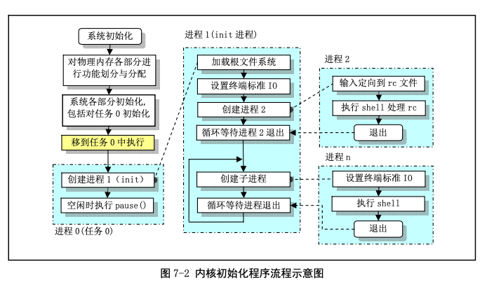

#1.init主流程

然后，内核进行所有方面的硬件初始化工作。包括陷阱门、块设备、字符设备和 tty，包括人工创建第 一个任务(task 0)。待所有初始化工作完成就设置中断允许标志，开启中断。在阅读这些初始化子程序时， 最好是跟着被调用的程序深入进去看，如果实在看不下去了，就暂时先放一放，继续看下一个初始化调用。 在有些理解之后再继续研究没有看完的地方。

在整个内核完成初始化后，内核将执行权切换到了用户模式，也即 CPU 从 0 特权级切换到了第 3 特 权级。然后系统第一次调用创建进程函数 fork()，创建出一个用于运行 init()的子进程。

在该进程(任务)中系统将运行控制台程序。如果控制台环境建立成功，则再生成一个子进程，用于 运行 shell 程序/bin/sh。若该子进程退出，父进程返回，则父进程进入一个死循环内，继续生成子进程，并 在此子进程中再次执行 shell 程序/bin/sh，而父进程则继续等待。

对于 Linux 来说，所有任务都是在用户模式运行的，包括很多系统应用程序，如 shell 程序、网络子系 统程序等。

#2.