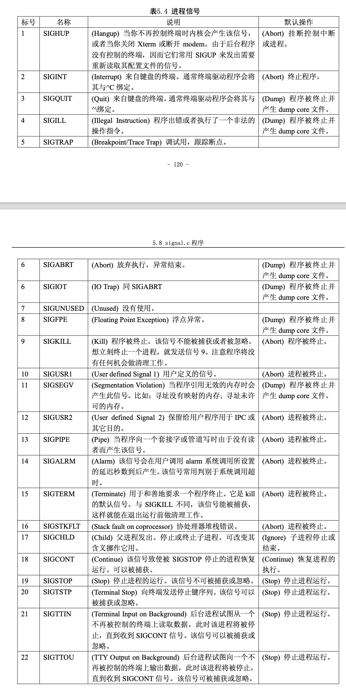

#1.signal no

进程中的信号是用于进程之间通信的一种简单消息，通常是下表中的一个标号数值，并且不携带任

何其它的信息。例如当一个子进程终止或结束时，就会产生一个标号为 17 的 SIGCHILD 信号发送给父 进程，以通知父进程有关子进程的当前状态。

关于一个进程如何处理收到的信号，一般有两种做法:一是程序的进程不去处理，此时该信号会由 系统相应的默认信号处理程序进行处理;第二种做法是进程使用自己的信号处理程序来处理信号。

