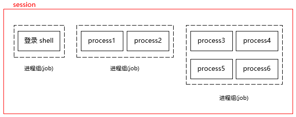
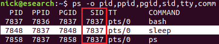
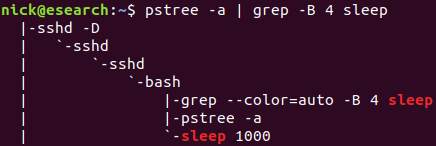
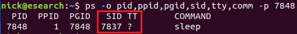
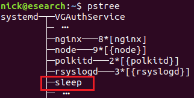
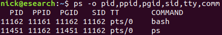
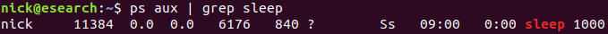
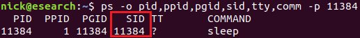
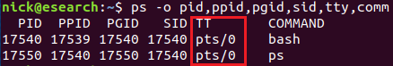

# [Linux session(会话)](https://www.cnblogs.com/liujunjun/p/12217771.html)

# session 是什么？

我们常见的 Linux session 一般是指 shell session。Shell session 是终端中当前的状态，在终端中只能有一个 session。当我们打开一个新的终端时，总会创建一个新的 shell session。

就进程间的关系来说，session 由一个或多个进程组组成。一般情况下，来自单个登录的所有进程都属于同一个 session。我们可以通过下图来理解进程、进程组和 session 之间的关系：



 会话是由会话中的第一个进程创建的，一般情况下是打开终端时创建的 shell 进程。该进程也叫 session 的领头进程。Session 中领头进程的 PID 也就是 session 的 SID。我们可以通过下面的命令查看 SID：

```plain
[root@localhost ~]# ps -o pid,ppid,pgid,sid,tty,comm
   PID   PPID   PGID    SID TT       COMMAND
 46882  46878  46882  46882 pts/0    bash
 46899  46882  46899  46882 pts/0    ps
```

Session 中的每个进程组被称为一个 job，有一个 job 会成为 session 的前台 job(foreground)，其它的 job 则是后台 job(background)。每个 session 连接一个控制终端(control terminal)，控制终端中的输入被发送给前台 job，从前台 job 产生的输出也被发送到控制终端上。同时由控制终端产生的信号，比如 ctrl + z 等都会传递给前台 job。

一般情况下 session 和终端是一对一的关系，当我们打开多个终端窗口时，实际上就创建了多个 session。

Session 的意义在于多个工作(job)在一个终端中运行，其中的一个为前台 job，它直接接收该终端的输入并把结果输出到该终端。其它的 job 则在后台运行。

# session 的诞生与消亡

通常，新的 session 由系统登录程序创建，session 中的领头进程是运行用户登录 shell 的进程。新创建的每个进程都会属于一个进程组，当创建一个进程时，它和父进程在同一个进程组、session 中。

将进程放入不同 session 的惟一方法是使用 setsid 函数使其成为新 session 的领头进程。这还会将 session 领头进程放入一个新的进程组中。

当 session 中的所有进程都结束时 session 也就消亡了。实际使用中比如网络断开了，session 肯定是要消亡的。另外就是正常的消亡，比如让 session 的领头进程退出。一般情况下 session 的领头进程是 shell 进程，如果它处于前台，我们可以使用 exit 命令或者是 ctrl + d 让它退出。或者我们可以直接通过 kill 命令杀死 session 的领头进程。这里面的原理是：当系统检测到挂断(hangup)条件时，内核中的驱动会将 SIGHUP 信号发送到整个 session。通常情况下，这会杀死 session 中的所有进程。

session 与终端的关系  
如果 session 关联的是伪终端，这个伪终端本身就是随着 session 的建立而创建的，session 结束，那么这个伪终端也会被销毁。  
如果 session 关联的是 tty1-6，tty 则不会被销毁。因为该终端设备是在系统初始化的时候创建的，并不是依赖该会话建立的，所以当 session 退出，tty 仍然存在。只是 init 系统在 session 结束后，会重启 getty 来监听这个 tty。

# nohup

如果我们在 session 中执行了 nohup 等类似的命令，当 session 消亡时，相关的进程并不会随着 session 结束，原因是这些进程不再受 SIGHUP 信号的影响。比如我们执行下面的命令：

```plain
$ nohup sleep 1000 >/dev/null 2>&1 & 
```



此时 sleep 进程的 sid 和其它进程是相同的，还可以通过 pstree 命令看到进程间的父子关系：



如果我们退出当前 session 的领头进程(bash)，sleep 进程并不会退出，这样我们就可以放心的等待该进程运行结果了。  
nohup 并不改变进程的 sid，同时也说明在这种情况中，虽然 session 的领头进程退出了，但是 session 依然没有被销毁(至少 sid 还在被引用)。重新建立连接，通过下面的命令查看 sleep 进程的信息，发现进程的 sid 依然是 7837：



但是此时的 sleep 已经被系统的 1 号进程 systemd 收养了：



# setsid

setsid 会创建一个新的 session，它的目的是让进程在后台执行命令，实现方式就是让命令进程运行在一个新的与终端脱离的 session 中。看下面的示例：

```plain
$ setsid sleep 1000
```

查找之下居然没有发现 sleep 进程的踪迹：



通过 grep 查询 sleep 进程的 PID：



去查看 sleep 进程所在的 sid，发现是一个新的 session ID，并且没有关联终端：



当一个进程通过调用 setsid 成为一个新的 session 领头进程时，它会与控制终端断开连接。

此时通过 pstree 查看进程间的关系，发现 sleep 进程直接被系统的 1 号进程 systemd 收养了：


# 控制终端(controlling terminal)

**控制终端是进程的一个属性。**通过 fork 系统调用创建的子进程会从父进程那里继承控制终端。这样，session 中的所有进程都从 session 领头进程那里继承控制终端。Session 的领头进程称为终端的控制进程(controlling process)。简单点说就是：**一个 session 只能与一个终端关联，这个终端被称为 session 的控制终端(controlling terminal)。**同时只能由 session 的领头进程来建立或者改变终端与 session 的联系。我们可以通过 ps 命令查看进程的控制终端：



支持 job control 的 **shell** 必须能够控制在某一时刻由哪个 job 使用终端。否则，可能会有多个 job 试图同时从终端读取数据，这会导致进程在接收用户输入时的混乱。为了防止这种情况发生，shell 必须按照预定的协议与终端驱动程序协作。

shell 一次只允许一个 job(进程组)访问控制终端。来自控制终端的某些输入会导致信号被发送到与控制终端关联的 job(进程组)中的所有进程。该 job 被称为控制终端上的前台 job。由 shell 管理的其他 job 在不访问终端的情况下，被称为后台 job。

Shell 的职责是通知 job 何时停止何时启动，还要把 job 的信息通知给用户，并提供机制允许用户继续暂停的 job、在前台和后台之间切换 job。比如前台 job 可以无限制的自由使用控制终端，而后台 job 则不可以。当后台 job 中的进程试图从其控制终端读取数据时，通常会向进程组发送 SIGTTIN 信号。这通常会导致该组中的所有进程停止(变成 stopped 状态)。类似地，当后台 job 中的进程试图写入其控制终端时，默认行为是向进程组发送 SIGTTOU 信号，但是否允许写入的控制会更加的复杂。

**参考：**  
[What is the definition of a “session” in linux?](https://superuser.com/questions/651111/what-is-the-definition-of-a-session-in-linux)  
[Linux session和进程组概述](https://segmentfault.com/a/1190000009152815)   
[Job Control](https://www.gnu.org/savannah-checkouts/gnu/libc/manual/html_node/Job-Control.html)  
[Linux TTY/PTS概述](https://segmentfault.com/a/1190000009082089)  
[setsid source code](https://git.kernel.org/pub/scm/utils/util-linux/util-linux.git/plain/sys-utils/setsid.c?id=HEAD)

分类: [CentOS7](https://www.cnblogs.com/liujunjun/category/1609262.html)

[好文要顶](javascript:) [关注我](javascript:) [收藏该文](javascript:) [](javascript: "分享至新浪微博") [](javascript: "分享至微信")

[](https://home.cnblogs.com/u/liujunjun/)

[星火撩原](https://home.cnblogs.com/u/liujunjun/)  
[关注 - 20](https://home.cnblogs.com/u/liujunjun/followees/)  
[粉丝 - 25](https://home.cnblogs.com/u/liujunjun/followers/)

[+加关注](javascript:)

0

0

[«](https://www.cnblogs.com/liujunjun/p/12214640.html) 上一篇： [Git详解及 github与gitlab使用](https://www.cnblogs.com/liujunjun/p/12214640.html "发布于 2020-01-19 16:58")  
[»](https://www.cnblogs.com/liujunjun/p/12217779.html) 下一篇： [Linux job control](https://www.cnblogs.com/liujunjun/p/12217779.html "发布于 2020-01-20 14:19")

posted @ 2020-01-20 14:17  [星火撩原](https://www.cnblogs.com/liujunjun/)  阅读(1017)  评论(0)  [编辑](https://i.cnblogs.com/EditPosts.aspx?postid=12217771)  [收藏](javascript:)