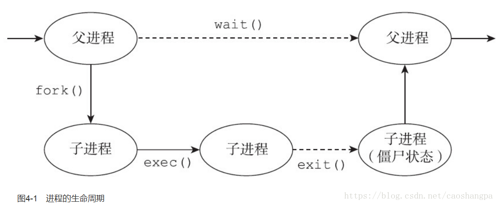
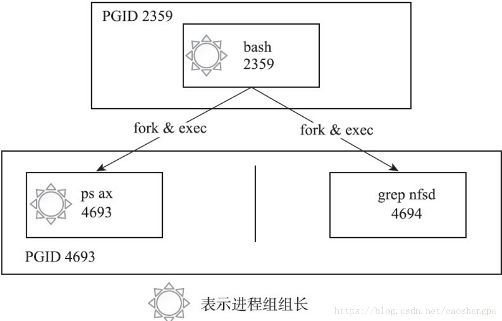
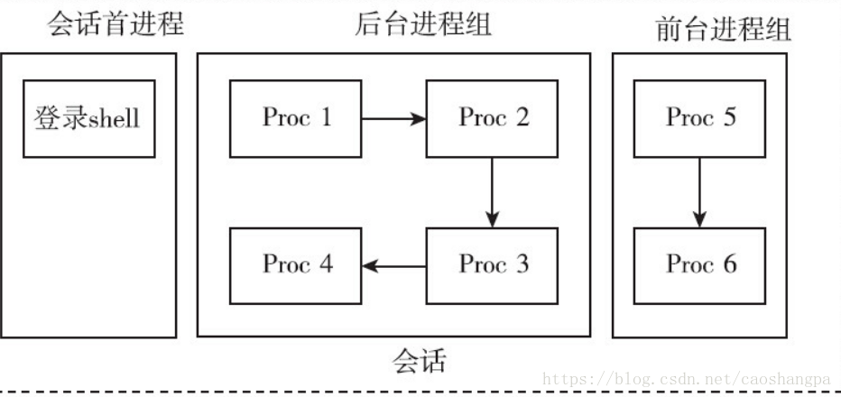

# linux之进程的基本概念(进程，进程组，会话关系）


[草上爬](https://blog.csdn.net/caoshangpa) 2018-04-29 09:02:30  5373  收藏  20 

分类专栏： [linux](https://blog.csdn.net/caoshangpa/category_7517437.html) 文章标签： [linux](https://www.csdn.net/tags/MtjaQg5sMDY0MC1ibG9n.html) [进程](https://www.csdn.net/tags/MtTaEg0sMDM5MjktYmxvZwO0O0OO0O0O.html) [进程组](https://so.csdn.net/so/search/s.do?q=%E8%BF%9B%E7%A8%8B%E7%BB%84&t=blog&o=vip&s=&l=&f=&viparticle=) [会话](https://www.csdn.net/tags/MtTaEg0sNDA3ODUtYmxvZwO0O0OO0O0O.html)

[


Qt5实用编程技术

Qt编程技术的点滴记录，实用，有创意。本专栏所有文章均提供源码下载。

草上爬


](https://blog.csdn.net/caoshangpa/category_10733354.html)

¥29.90

订阅博主

**进程**

进程是操作系统的一个核心概念。每个进程都有自己唯一的标识：进程ID，也有自己的生命周期。一个典型的进程的生命周期如图4-1所示。

  

进程都有父进程，父进程也有父进程，这就形成了一个以init进程为根的家族树。除此以外，进程还有其他层次关系：进程、进程组和会话。  
进程组和会话在进程之间形成了两级的层次：进程组是一组相关进程的集合，会话是一组相关进程组的集合。  
这样说来，一个进程会有如下ID：  
·PID：进程的唯一标识。对于多线程的进程而言，所有线程调用getpid函数会返回相同的值。  
·PGID：进程组ID。每个进程都会有进程组ID，表示该进程所属的进程组。默认情况下新创建的进程会继承父进程的进程组ID。  
·SID：会话ID。每个进程也都有会话ID。默认情况下，新创建的进程会继承父进程的会话ID。  
可以调用如下指令来查看所有进程的层次关系：  

```cpp
ps -ejH
ps axjf 
```

进程，可以调用以下函数获取进程组ID跟会话ID.  

```cpp
pid_t getpgrp(void);
pid_t getsid(pid_t pid); 
```

前面提到过，新进程默认继承父进程的进程组ID和会话ID，如果都是默认情况的话，那么追根溯源可知，所有的进程应该有共同的进程组ID和会话ID。但是调用ps axjf可以看到，实际情况并非如此，系统中存在很多不同的会话，每个会话下也有不同的进程组。  
为何会如此呢？  
就像家族企业一样，如果从创业之初，所有家族成员都墨守成规，循规蹈矩，默认情况下，就只会有一个公司、一个部门。但是也有些“叛逆”的子弟，愿意为家族公司开疆拓土，愿意成立新的部门。这些新的部门就是新创建的进程组。如果有子弟“离经叛道”，甚至不愿意呆在家族公司里，他别开天地，另创了一个公司，那这个新公司就是新创建的会话组。由此可见，系统必须要有改变和设置进程组ID和会话ID的函数接口，否则，系统中只会存在一个会话、一个进程组。  
进程组和会话是为了支持shell作业控制而引入的概念。  
当有新的用户登录Linux时，登录进程会为这个用户创建一个会话。用户的登录shell就是会话的首进程。会话的首进程ID会作为整个会话的ID。会话是一个或多个进程组的集合，囊括了登录用户的所有活动。  
在登录shell时，用户可能会使用管道，让多个进程互相配合完成一项工作，这一组进程属于同一个进程组。  

当用户通过SSH客户端工具（putty、xshell等）连入Linux时，与上述登录的情景是类似的。

**进程组**

修改进程组ID的接口如下  

```cpp
int setpgid(pid_t pid, pid_t pgid); 
```

这个函数的含义是，找到进程ID为pid的进程，将其进程组ID修改为pgid，如果pid的值为0，则表示要修改调用进程的进程组ID。该接口一般用来创建一个新的进程组。  
下面三个接口含义一致，都是创立新的进程组，并且指定的进程会成为进程组的首进程。如果参数pid和pgid的值不匹配，那么setpgid函数会将一个进程从原来所属的进程组迁移到pgid对应的进程组。  

```cpp
setpgid(0,0)
setpgid(getpid(),0)
setpgid(getpid(),getpid()) 
```

setpgid函数有很多限制：  
·pid参数必须指定为调用setpgid函数的进程或其子进程，不能随意修改不相关进程的进程组ID，如果违反这条规则，则返回-1，并置errno为ESRCH。  
·pid参数可以指定调用进程的子进程，但是子进程如果已经执行了exec函数，则不能修改子进程的进程组ID。如果违反这条规则，则返回-1，并置errno为EACCESS。  
·在进程组间移动，调用进程，pid指定的进程及目标进程组必须在同一个会话之内。这个比较好理解，不加入公司（会话），就无法加入公司下属的部门（进程组），否则就是部门要造反的节奏。如果违反这条规则，则返回-1，并置errno为EPERM。  
·pid指定的进程，不能是会话首进程。如果违反这条规则，则返回-1，并置errno为EPERM。  
有了创建进程组的接口，新创建的进程组就不必继承父进程的进程组ID了。最常见的创建进程组的场景就是在shell中执行管道命令，代码如下：cmd1 | cmd2 | cmd3  

下面用一个最简单的命令来说明，其进程之间的关系如图4-2所示。

```cpp
ps ax|grep nfsd 
```

  
ps进程和grep进程都是bash创建的子进程，两者通过管道协同完成一项工作，它们隶属于同一个进程组，其中ps进程是进程组的组长。  
进程组的概念并不难理解，可以将人与人之间的关系做类比。一起工作的同事，自然比毫不相干的路人更加亲近。shell中协同工作的进程属于同一个进程组，就如同协同工作的人属于同一个部门一样。  
引入了进程组的概念，可以更方便地管理这一组进程了。比如这项工作放弃了，不必向每个进程一一发送信号，可以直接将信号发送给进程组，进程组内的所有进程都会收到该信号。  
前文曾提到过，子进程一旦执行exec，父进程就无法调用setpgid函数来设置子进程的进程组ID了，这条规则会影响shell的作业控制。出于保险的考虑，一般父进程在调用fork创建子进程后，会调用setpgid函数设置子进程的进程组ID，同时子进程也要调用setpgid函数来设置自身的进程组ID。这两次调用有一次是多余的，但是这样做能够保证无论是父进程先执行，还是子进程先执行，子进程一定已经进入了指定的进程组中。由于fork之后，父子进程的执行顺序是不确定的，因此如果不这样做，就会造成在一定的时间窗口内，无法确定子进程是否进入了相应的进程组。  
用户在shell中可以同时执行多个命令。对于耗时很久的命令（如编译大型工程），用户不必傻傻等待命令运行完毕才执行下一个命令。用户在执行命令时，可以在命令的结尾添加“&”符号，表示将命令放入后台执行。这样该命令对应的进程组即为后台进程组。在任意时刻，可能同时存在多个后台进程组，但是不管什么时候都只能有一个前台进程组。只有在前台进程组中进程才能在控制终端读取输入。当用户在终端输入信号生成终端字符（如ctrl+c、ctrl+z、ctr+\\等）时，对应的信号只会发送给前台进程组。  

shell中可以存在多个进程组，无论是前台进程组还是后台进程组，它们或多或少存在一定的联系，为了更好地控制这些进程组（或者称为作业），系统引入了会话的概念。会话的意义在于将很多的工作囊括在一个终端，选取其中一个作为前台来直接接收终端的输入及信号，其他的工作则放在后台执行。

**会话**

会话是一个或多个进程组的集合，以用户登录系统为例，可能存在如图4-3所示的情况。  
  
系统提供setsid函数来创建会话，其接口定义如下：  

```cpp
#include <unistd.h>
pid_t setsid(void); 
```

如果这个函数的调用进程不是进程组组长，那么调用该函数会发生以下事情：  
1）创建一个新会话，会话ID等于进程ID，调用进程成为会话的首进程。  
2）创建一个进程组，进程组ID等于进程ID，调用进程成为进程组的组长。  
3）该进程没有控制终端，如果调用setsid前，该进程有控制终端，这种联系就会断掉。  
调用setsid函数的进程不能是进程组的组长，否则调用会失败，返回-1，并置errno为EPERM。  

这个限制是比较合理的。如果允许进程组组长迁移到新的会话，而进程组的其他成员仍然在老的会话中，那么，就会出现同一个进程组的进程分属不同的会话之中的情况，这就破坏了进程组和会话的严格的层次关系了。

  

原文链接：[http://www.cnblogs.com/zengyiwen/p/5755191.html](http://www.cnblogs.com/zengyiwen/p/5755191.html)