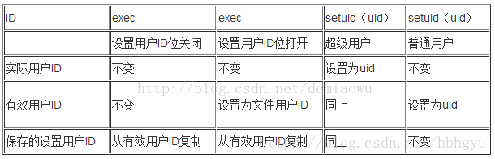

# (3条消息) Linux EUID，SUID，RUID简单理解_Ray的博客-CSDN博客

> 最近在做信息系统安全中的实验，实验基于Syracuse SEED labs，其中设计比较多的是set-uid程序，那么就必须要对RUID（实际用户）、EUID(有效用户)、SUID(保存用户)几个概念有一个比较清晰的认识，以下内容便于以后及时回顾。

1，基本概念：  
实际用户ID（RUID）：用于标识一个系统中用户是谁，一般是在登录之后，就被唯一确定的，就是登陆的用户的uid

有效用户ID（EUID）：用于系统决定用户对系统资源的权限。也就是说当用户做任何一个操作时，最终看它有没有权限，都是在判断有效用户ID是否有权限，如果有，则OK，否则报错不能执行。在正常情况下，一个用户登录之后（我们假设是A用户），A用户的有效用户ID和实际用户ID是相同的，但是如果A用户在某些场景中想要执行一些特权操作，而上面我们说到用户的任何操作，LINUX内核都是通过检验有效用户ID来判断当前执行这个操作的用户是否具有权限，显然是特权操作，A用户没有权限，所以A用户就只能通过一定的手段来修改当前的有效用户ID使其具有执行特权操作的权限。这里说明了下面为什么我们需要修改有效用户ID，就是想再某一时刻能够执行一些特权操作。下面在举例说明。

设置用户ID位：用于对外的权限的开发，它的作用是我们如何去修改有效用户ID，在后面的例子中在展开。

保存设置用户ID（SUID）：是有效用户ID副本，既然有效用户ID是副本，那么它的作用肯定是为了以后恢复有效用户ID用的。

2，改变三个用户ID的方法  
下面这幅图给出了改变实际用户ID，有效用户ID和保存设置用户ID的方法  

3，实例1，如何在权限不够的情况下执行特权权限，也就是更改我们的有效用户ID。  
我们知道用户的密码都是存放在/etc/shadow文件下，我们看下这个文件的权限root@debian:~# ls -l /etc/shadow  
\-rw-r—– 1 root shadow 8013 Sep 8 14:58 /etc/shadow  
假如我是一个普通用户，显然我是可以修改我的密码的，通过passwd命令，无可厚非。自己修改自己的密码肯定是被允许的。但是仔细想想你会发现不对啊，我作为一个普通用户登录后，我的实际用户ID和有效用户ID都是我自己的UID。从上面可以看出，显然我不具有修改/etc/shadow文件的权限，那我执行passwd命令时怎么改我的密码的呢？在上面1，基本概念中我们知道决定我们权限的是执行操作时的有效用户ID，所有我们在执行passwd命令时，我们的有效用户ID肯定被修改了。OK，我们看下面：root@debian:~# ls -l /usr/bin/passwd  
\-rwsr-xr-x 1 root root 43280 Feb 16 2011 /usr/bin/passwd我们看到了一个s，对的，它就是我们的保存设置用户ID位，上面我们说过这个位的作用就是修改有效用户ID，那我们来看看他是如何修改执行passwd命令时的有效用户ID的。  
首先我们看下命令执行的过程，当普通用户执行passwd命令时，shell会fork出一个子进程，此时进程有效用户ID还是普通用户ID，然后exec程序执行/usr/bin/passwd。通过上面的表我们会知道，exec发现/usr/bin/passwd有SUID位，于是会把进程的有效用户ID设成设置成文件用户ID，显然就是root, 此时这个进程都获得了root权限, 得到了读写/etc/shadow文件的权限, 从而普通用户可完成密码的修改。exec进程退出后会恢复普通用户的EUID为普通用户ID.这样就不会使普通用户一直拥有root权限。  
这就是我们设置用户ID位的作用，它的存在就是为了普通用户在某些需要特权权限时，去临时的改变有效用户ID而获得特权权限。但是你可能有疑问，为什么我们不用setuid()直接修改呢？何苦绕这么大的弯子。但是如果可以使用setuid()来直接修改有效用户ID来获得特权权限，那么我们的特权权限就会不可控了。这违背了最小权限模型。所以我们Linux特意将setuid设置成在非特权用户下面，有效用户ID只能设置成为实际用户ID和保存设置用户ID，而保存设置用户ID又是来自于有效用户ID的复制，而有效用户ID只能是实际用户ID或者文件所有者ID（在你设置了保存设置用户ID情况下才可以）。这样你就没法将有效用户ID设置成随意值，所以对普通用户创建的任何文件如果没有得到超级用户的授权，那么无论他怎么编写代码来设置自己的有效用户ID，或者设置保存用户ID位，由于你这个可执行文件是你自己编写的，所有你的权限更本没有得到实质性的改变。这里也就是说只有root自己创建的文件才具有这样的特权权限。这样是不是很好的保护了操作系统对权限的控制呢？

4，实例2，保存设置用户ID的作用  
那么保存设置用户ID的作用又是什么呢？既然保存用户ID是有效用户ID的副本，那么肯定是为在某个时刻用于恢复我们的有效用户ID。这样就可能实现我们的用户权限的切换。例如：man（这是AUP上面的例子，当然实际linux上好像不是这样实现，不过为了便于说明，还是直接使用了这个例子）  
man程序的实际用户ID是man，有效用户ID也是man  
1、首先我们的进程要执行man命令，所以exec发现/usr/bin/man已经设置了用户ID位，于是进程的有效用户ID给改了/usr/bin/man的拥有者，即改成man了，并且复制了man给保存设置用户ID，然后我们就可以顺利执行man命令了。  
此时我们进程的ID：  
实际用户ID = 我们的用户ID  
有效用户ID = man（为了执行man命令）  
保存的设置用户ID = man（exec设置的）man程序访问需要配置文件和手册页，这些文件时名为man的用户所有的，因为有效用户ID是man,所有我们的操作得以顺利的被执行了。2，我们的进程要求man执行其他命令（这里不仅我们要执行man命令，我们还会让man代表我们执行一些命令），但是现在我们的有效ID是man，所以需要更改有效ID为我们进程的实际ID，调用setuid（getuid（））函数,由于我不是超级用户，所以，  
实际用户ID = 我们的用户ID  
有效用户ID = 我们的用户ID（setuid改的）  
保存的设置用户ID = man现在man进程是以我们的用户ID而运行的，这就意味着能访问的只有我们通常可以访问的，而没有额外的权限，  
3，当man完成代替我们执行的命令后，我们当然要回到我们之前有效用户ID，也就是man,此时我们的保存设置用户ID这个副本就开始发挥它的作用了，我们只需要setuid(geteuid());即可，通过了这个有效用户ID的副本保存设置用户ID，我们的有效用户ID才能在man->uid->man这样的切换。如果没有保存设置用户ID这个副本，显然，我们是没有办法在man程序代替我们执行完命令之后，在将有效用户ID设置成man的。