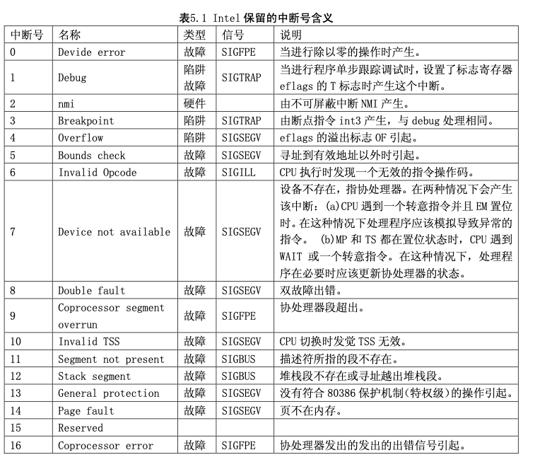

#1.硬件中断处理程序

中断信号通常可以分为两类:硬件中断和软件中断(异常)。每个中断是由 0-255 之间的一个数字来标 识。对于中断 int0--int31(0x00--0x1f)，每个中断的功能是由 Intel 固定设定或保留用的, 属于软件中断， 但 Intel 称之为异常。因为是由 CPU 执行指令时探测到异常时引起的。通常还可分为故障(Fault)和陷阱 (traps)两类。中断 int32--int255 (0x20--0xff)可以由用户自己设定。在 Linux 系统中，则将 int32--int47(0x20--0x2f)对应于 8259A 中断控制芯片发出的硬件中断请求信号 IRQ0-IRQ15;并把程序编 程发出的系统调用(system_call)中断设置为 int128(0x80)。

在将控制权交给中断处理程序之前，CPU 会首先将至少 12 字节的信息压入中断处理程序的堆栈中。 这种情况与一个长调用(段间子程序调用)比较相象。CPU 会将代码段选择符和返回地址的偏移值压入 堆栈。另一个与段间调用比较相象的地方是 80386 将信息压入到了目的代码的堆栈上，而不是被中断代 码的堆栈。另外，CPU 还总是将标志寄存器 EFLAGS 的内容压入堆栈。如果优先级别发生了变化，比如 从用户级改变到内核系统级，CPU 还会将原代码的堆栈段值和堆栈指针压入中断程序的堆栈中。对于具 有优先级改变时堆栈的内容示意图见图 5.1 所示。

asm.s 代码文件主要涉及对 Intel 保留中断 int0--int16 的处理，其余保留的中断 int17-int31 由 Intel 公 司留作今后扩充使用。对应于中断控制器芯片各 IRQ 发出的 int32-int47 的 16 个处理程序将分别在各种 硬件(如时钟、键盘、软盘、数学协处理器、硬盘等)初始化程序中处理。Linux 系统调用中断 int128(0x80) 的处理则将在 kernel/system_call.s 中给出。各个中断的具体定义见代码注释后其它信息一节中的说明。

由于有些异常引起中断时，CPU 内部会产生一个出错代码压入堆栈(异常中断 int 8 和 int10 - int 14)， 见图 5.1 所示，而其它的中断却并不带有这个出错代码(例如被零除出错和边界检查出错等)，因此，asm.s 程序中将所有中断的处理根据是否携带出错代码而分别进行处理。但处理流程还是一样的。

#2.硬件异常所引起的中断的处理过程

对一个硬件异常所引起的中断的处理过程见下度所示(图 5.2)。

#3.Intel 保留中断向量的定义

这里给出了 Intel 保留中断向量具体含义的说明，见表 5.1 所示。

