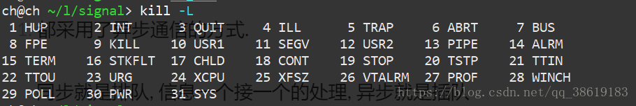
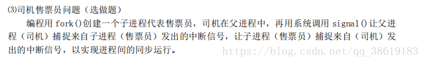

# 信号的基本概念

信号机制别名软中断, 在<signal.h>系统头文件中定义了一系列的信号编号, 都对应着一个正整数常量:  
  
进程在用户空间运行时, 都要用信号机制来检查是否有信号到达, 而一般的进程默认对应信号的处理都是killed, 除非使用`signal(信号编号, 处理方式)`函数来处理(所以别名软中断

### 信号和中断的相似点

1.  都采用了异步通信的方式.
    
    ​ 同步就是排队, 信息一个接一个的处理, 异步就是插队
    
2.  都是暂停当前的, 去执行对应的handle程序
    
3.  都是处理完返回原来位置
    
4.  对于信号和中断, 都是可以屏蔽的
    

### 信号与中断的区别

1.  中断有优先级, 信号没有
2.  信号处理程序在用户态下运行的, 中断程序在核心态下运行的
3.  中断响应是及时的, 当信号响应一般有延迟

# 信号的使用

### 信号的功能

1.  发送信号
2.  预置对信号的处理方式
3.  收受信号的进程an预置完成对应处理

### 信号的发送

由发送进程把信号送到指定进程的信号域的某一位上. 如果指定基础正在一个可被中断的优先级上睡眠, 核心便将其叫醒, 发送进程就此结束

*   一个进程的信号域可以有多个信号位被置位
*   一个信号位只处理当前最后的信号handle
*   进程用kill(pid,signum)发送信号位

### 信号的处理时间

##### 检查软中断:

*   进入或退出低优先级睡眠状态
*   进程即将从核心态返回用户态时

##### 不理睬软中断

*   进程处于核心态

##### 处理软中断

*   只在用户态下处理

### 信号处理方式

*   忽略软中断 SIG\_IGN
*   收到软中断就退出 SIG\_DFL
*   收到软中断跳转到对应函数(以下)

# 代码粘贴

### 题目要求



```
#include <stdlib.h>/*{{{*/
#include <stdio.h>
#include <wait.h>
#include <unistd.h>
#include <sys/types.h>
#include <sys/wait.h>
#include <signal.h>/*}}}*/

int loop_driver = 0;
int loop_seller = 0;
int fork_id;

void handle_driver(int signum)
{
	loop_driver = 1;
	printf("driver: bus has stop\n");
	kill(fork_id,SIGUSR1);

}

void handle_seller(int signum)
{
	loop_seller = 1;
	printf("seller: OK, it's busy time \n");
}

int main()
{
	signal(SIGINT,SIG_IGN);
	while(-1 == (fork_id = fork()));
	while(1){
		if (fork_id > 0)// in parent
		{
			signal(SIGINT,handle_driver);
			while(1 != loop_driver){
				sleep(1);
				printf("driver: keep driver\n");
			}
			loop_driver = 0;
		}
		else// in child
		{
			signal(SIGUSR1,handle_seller);
			while(1 != loop_seller){
				sleep(1);
				printf("seller: sell tickets or check account\n");
			}
			loop_seller = 0;
		}
	}
}

```