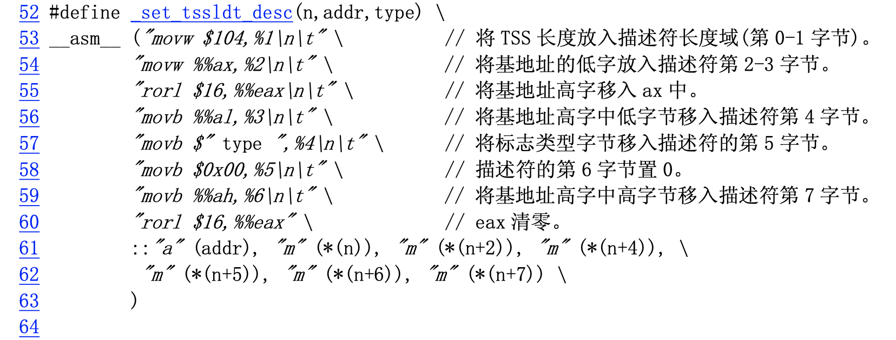

#1._set_tssldt_desc

```cpp
//// 在全局表中设置任务状态段/局部表描述符。
// 参数:n - 在全局表中描述符项 n 所对应的地址;
// addr - 状态段/局部表所在内存的基地址。 
// type - 描述符中的标志类型字节。
//%0 - eax(地址 addr);%1 - (描述符项 n 的地址);%2 - (描述符项 n 的地址偏移 2 处);
//%3 - (描述符项n的地址偏移4处);%4 - (描述符项n的地址偏移5处)
//%5 - (描述符项n的地址偏移6处);%6 - (描述符项n的地址偏移7处)


```

