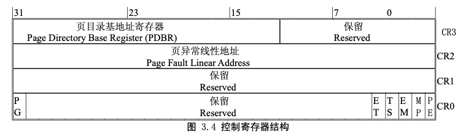
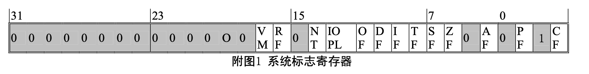
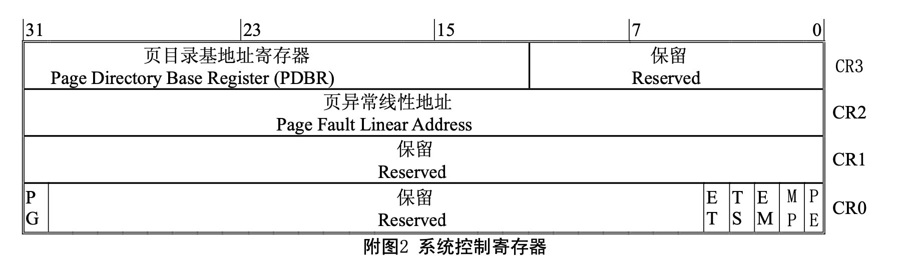

#1.各种寄存器
* AX--accumulator, 累加寄存器
* CS--counter，计数寄存器
* DX--data，数据寄存器
* BX--base，基址寄存器
* SP--stack pointer，栈指针寄存器
* BP——base pointer，基址指针寄存器
* SI--source index，源变址寄存器
* DI——destination index，目的变址寄存器


* ES——附加段寄存器(extra segment)
* CS——代码段寄存器(code segment)
* SS——栈段寄存器(stack segment)
* DS——数据段寄存器(data segment)
* FS——没有名称（segment part 2）
* GS——没有名称（segment part 3）
*


* CR0——特殊的32位寄存器，也就是control register 0，是一个非常重要的寄存器，只有操作系统才能使用。
* EFLAGS——存储CPU运算的一些标志位
* GDT0——保存GDT的地址。
* IMR: interrupt mask register, 中断屏蔽寄存器
* ICW: initial control word. 初始化控制数据

* EIP——extended instruction pointer。扩展指令指针寄存器。
        EIP是CPU用来记录下一条需要执行的指令，位于内存中的哪个地址的寄存器。每执行一条指令，EIP中的值就自动累加，从而一直保证指向下一条指令的地址。
* TR——task register。作用是让CPU记住当前正在运行哪一个任务。当进行任务切换的时候，TR寄存器的值也会自动变化。我们给TR寄存器赋值的时候，必须把GDT的编号乘以8，Intel这样规定。


#2.寄存器限制
* 只有BX、BP、SI、DI几个寄存器，可以用寄存器指定内存地址，剩下的AX、CX、DX、SP不可以。（SP也可以吧？？？？只能读不能写？？？？）
* C语言和汇编联合使用的时候，EAX, ECX, EDX这几个寄存器可以随便使用，其它寄存器只能读，不能写。因为其它寄存器在编译C语言时，用来存重要的值。

#3.EFLAGS
它是一个叫做EFLAGS的特殊寄存器。这是由名为FLAGS的16位寄存器扩展而来的32位寄存器。FLAGS是存储进位标志和中断标志等标志的寄存器。
* 进位标志可以通过JC货JNC等跳转指令来简单地判断到底是0还是1.
* 但对于中断标志，没有类似的JI或JNI命令，所以只能读入EFLAGS，再检查第九位是0还是1.顺便说一下，进位标志是EFLAGS的第0位。

* 能够用来读写EFLAGS的，只有PUSHFD和POPFD指令。
PUSHFD： push flags double-word，意思是将标志位的值按双字节长压入栈。其实它所做的，就是“PUSH EFLAGS”。
POPFD： pop flags double-word, 意思是按双字节长将标志位从栈弹出。它所做的，就是“POP EFLAGS”

#4.段寄存器
我们使用寄存器时候，以ES：BX这种方式来表示地址，写成"Mov AL,[ES:BX]"，它代表ES*16+BX的内存地址。

ES带入0xffff，BX带入oxffff，就是114095字节，也就是1MB以内地址。

一般默认的段寄存器是DS，默认是0.

#5.inthandler21
```x86asm
_asm_inthandler21:
        PUSH    ES
        PUSH    DS
        PUSHAD
        MOV     EAX,ESP
        PUSH    EAX
        MOV     AX,SS
        MOV     DS,AX
        MOV     ES,AX
        CALL    _inthandler21
        POP     EAX
        POPAD
        POP     DS
        POP     ES
        IRETD
```
这个函数将寄存器的值保存到栈里，然后将DS和ES调整到与SS相等，再调用_inthandler21，返回以后，将所有寄存器的值再返回到原来的值，然后执行IRETD。

关于在DS和ES中放入SS的部分，因为C语言自以为是地认为“DS == ES == SS”，如果不按照这样设定的话，无法调用C语言的程序inthandler21. 


#6.内存管理寄存器
Intel 80386 CPU 有 4 个寄存器用来定位控制分段内存管理的数据结构: 

GDTR (Global Descriptor Table Register)全局描述符表寄存器;

LDTR (Local Descriptor Table Register)局部描述符表寄存器;
这两个寄存器用于指向段描述符表 GDT 和 LDT。这两个表是用于内存的分页管理，参见附录中的描 述。

IDTR (Interrupt Descriptor Table Register)中断描述符表寄存器; 这个寄存器指向中断处理向量(句柄)表(IDT)的入口点。所有中断处理过程的入口地址信息均存
放在该表中的描述符表项中。

TR (Task Register)任务寄存器;
该寄存器指向处理器定义当前任务(进程)所需的信息，也即任务数据结构 task{}。

#7. 控制寄存器
Intel 80386的控制寄存器共有4个，分别命名为CR0、CR1、CR2、CR3。这些寄存器仅能够由系统 程序通过 MOV 指令访问。见图 3.4 所示。



```
控制寄存器 CR0 含有系统整体的控制标志，它控制或指示出整个系统的运行状态或条件。其中:
PE – 保护模式开启位(Protection Enable，比特位 0)。如果设置了该比特位，就会使处理器开始在保护模 式下运行。
MP – 协处理器存在标志(Math Present，比特位 1)。用于控制 WAIT 指令的功能，以配合协处理的运行。 EM – 仿真控制(Emulation，比特位 2)。指示是否需要仿真协处理器的功能。
TS – 任务切换(Task Switch，比特位 3)。每当任务切换时处理器就会设置该比特位，并且在解释协处理 器指令之前测试该位。
ET – 扩展类型(Extention Type，比特位 4)。该位指出了系统中所含有的协处理器类型(是 80287 还是 80387)。
PG – 分页操作(Paging，比特位 31)。该位指示出是否使用页表将线性地址变换成物理地址。参见第 10 章对分页内存管理的描述。
CR2 用于 PG 置位时处理页异常操作。CPU 会将引起错误的线性地址保存在该寄存器中。
CR3 同样也是在 PG 标志置位时起作用。该寄存器为 CPU 指定当前运行的任务所使用的页表目录。
```

#8.系统寄存器

设计用于系统编程的系统寄存器主要包括以下几类: 标志寄存器 EFALGS;
内存管理寄存器;
控制寄存器;
调试寄存器;
测试寄存器。
系统标志寄存器 EFLAGS 控制着 I/O、可屏蔽中断、调试、任务切换以及保护模式和多任务环境下虚 拟 8086 程序的执行。其中主要标志见下图所示。


其中系统标志:VM – 虚拟 8086 模式;RF – 恢复标志;NT – 嵌套任务标志;IO PL – I/O 特权级标志;IF – 中断允许标志。
内存管理寄存器有 4 个，用于分段内存管理:
• GDTR – 全局描述符表寄存器(Global Descriptor Table Register);
• LDTR – 局部描述符表寄存器(Local Descriptor Table Register);
• IDTR – 中断描述符表寄存器(Interrupt Descriptor Table Register);
• TR – 任务寄存器。
其中前两个寄存器(GDTR,LDTR)分别指向段描述符表 GDT 和 LDT。IDTR 寄存器指向中断向量表。
TR 寄存器指向处理器所需的当前任务的信息。
80386 共有 4 个控制寄存器，分别是 CR0、CR1、CR2 和 CR3。格式见下图所示。



控制寄存器 CR0 􏰂有系统整体的控制标志。其中:
• PE – 保护模式开启位(Protection Enable，比特位 0)。如果设置了该比特位，就会使处理器开始在
保护模式下运行。
• MP – 协处理器存在标志(Math Present，比特位 1)。用于控制 WAIT 指令的功能，以配合协处理
的运行。
• EM – 仿真控制(Emulation，比特位 2)。指示是否需要仿真协处理器的功能。
• TS – 任务切换(Task Switch，比特位 3)。每当任务切换时处理器就会设置该比特位，并且在解释
   协处理器指令之前测试该位。
• ET – 扩展类型(Extention Type，比特位 4)。该位指出了系统中所􏰂有的协处理器类型(是 80287
还是 80387)。
• PG – 分页操作(Paging，比特位 31)。该位指示出是否使用页表将线性地址变换成物理地址。


