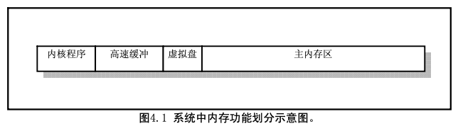
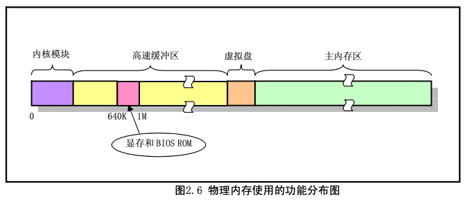
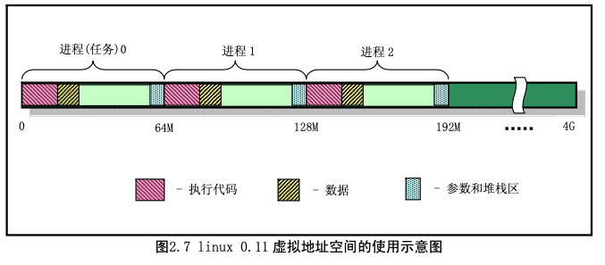

#1.overall

这里先总的说明一下 Linux 操作系统启动部分的主要执行流程。当 PC 的电源打开后，80x86 结构的 CPU 将自动进入实模式，并从地址 0xFFFF0 开始自动执行程序代码，这个地址通常是 ROM-BIOS 中的地 址。PC 机的 BIOS 将执行某些系统的检测，并在物理地址 0 处开始初始化中断向量。此后，它将可启动设 备的第一个扇区(磁盘引导扇区，512 字节)读入内存绝对地址 0x7C00 处，并跳转到这个地方。启动设 备通常是软驱或是硬盘。这里的叙述是非常简单的，但这已经足够理解内核初始化的工作过程了。

Linux 的最最前面部分是用 8086 汇编语言编写的(boot/bootsect.s)，它将由 BIOS 读入到内存绝对地址 0x7C00(31KB)处，当它被执行时就会把自己移到绝对地址 0x90000(576KB)处，并把启动设备中后 2kB 字 节代码(boot/setup.s)读入到内存 0x90200 处，而内核的其它部分(system 模块)则被读入到从地址 0x10000 开始处，因为当时system模块的长度不会超过0x80000字节大小(即512KB)，所以它不会覆盖在0x90000 处开始的 bootsect 和 setup 模块。随后将 system 模块移动到内存起始处，这样 system 模块中代码的地址也 即等于实际的物理地址。便于对内核代码和数据的操作。图 3.1 清晰地显示出 Linux 系统启动时这几个程 序或模块在内存中的动态位置。其中，每一竖条框代表某一时刻内存中各程序的映像位置图。在系统加载 期间将显示信息"Loading..."。然后控制权将传递给 boot/setup.s 中的代码，这是另一个实模式汇编语言程序。

启动部分识别主机的某些特性以及 vga 卡的类型。如果需要，它会要求用户为控制台选择显示模式。 然后将整个系统从地址 0x10000 移至 0x0000 处，进入保护模式并跳转至系统的余下部分(在 0x0000 处)。 此时所有32位运行方式的设置启动被完成: IDT、GDT以及LDT被加载，处理器和协处理器也已确认， 分页工作也设置好了;最终调用 init/main.c 中的 main()程序。上述操作的源代码是在 boot/head.S 中的，这 可能是整个内核中最有诀窍的代码了。注意如果在前述任何一步中出了错，计算机就会死锁。在操作系统 还没有完全运转之前是处理不了出错的。

#2.内存设计规划

main.c 程序首先利用 setup.s 程序取得的系统参数设置系统的根文件设备号以及一些内存全局变量。这
些内存变量指明了主内存的开始地址、系统所拥有的内存容量和作为高速缓冲区内存的末端地址。如果还 定义了虚拟盘(RAMDISK)，则主内存将适当减少。整个内存的映像示意图见图 4.1 所示。

图中，高速缓冲部分还要扣除被显存和 ROM BIOS 占用的部分。高速缓冲区是用于磁盘等块设备临时 存放数据的地方，以 1K(1024)字节为一个数据块单位。主内存区域的内存是由内存管理模块 mm 通过 分页机制进行管理分配，以 4K 字节为一个内存页单位。内核程序可以自由访问高速缓冲中的数据，但需 要通过 mm 才能使用分配到的内存页面。

#3.linux对内存的使用方法

在 linux 0.11 内核中，为了有效地使用系统的物理内存，内存被划分成几个功能区域，见下图 2.6 所示。

其中，linux 内核程序占据在物理内存的开始部分，接下来是用于供硬盘或软盘等块设备使用的高速缓 冲区部分。当一个进程需要读取块设备中的数据时，系统会首先将数据读到高速缓冲区中;当有数据需要 写到块设备上去时，系统也是先将数据放到高速缓冲区中，然后由块设备驱动程序写到设备上。最后部分 是供所有程序可以随时申请使用的主内存区部分。内核程序在使用主内存区时，也同样要首先向内核的内 存管理模块提出申请，在申请成功后方能使用。对于含有 RAM 虚拟盘的系统，主内存区头部还要划去一 部分，共虚拟盘存放数据。

由于计算机系统中所含的实际物理内存容量是有限制的。为了能有效地使用这些物理内存，Linux 采 用了Intel CPU的内存分页管理机制，使用虚拟线性地址与实际物理内存地址映射的方法让所有同时执行 的程序共同使用有限的内存。内存分页管理的基本原理是将整个主内存区域划分成 4096 字节为一页的内 存页面。程序申请使用内存时，就以内存页为单位进行分配。

在使用这种内存分页管理方法时，每个执行中的进程(任务)可以使用比实际内存容量大得多的线性 地址空间。对于 Intel 80386 系统，其 CPU 可以提供多达 4G 的线性地址空间。对于 linux 0.11 内核，系统 设置全局描述符表 GDT 中的段描述符项数最大为 256，其中 2 项空闲、2 项系统使用，每个进程使用两项。 因此，此时系统可以最多容纳(256-4)/2 + 1=127 个任务，并且虚拟地址范围是 ((256-4)/2)* 64MB 约等于 8G。但 0.11 内核中人工定义最大任务数 NR_TASKS = 64 个，每个进程虚拟地址(或线性地址)范围是 64M， 并且各个进程的虚拟地址起始位置是(任务号-1)*64MB。因此所使用的虚拟地址空间范围是 64MB*64 =4G， 见图 2.7 所示。4G 正好与 CPU 的线性地址空间范围或物理地址空间范围相同，因此在 0.11 内核中比较容 易混淆三种地址概念。

linux 0.11 中，在进行地址映射时，我们需要分清 3 种地址之间的变换:a. 进程虚拟地址，是从虚拟 地址 0 开始计，最大 64M;b. CPU 的线性地址空间(0--4G);c. 实际物理内存地址。

进程的虚拟地址需要首先通过其局部段描述符变换为 CPU 整个线性地址空间中的地址，然后再使用页目录表 PDT(一级页表)和页表 PT(二级页表)映射到实际物理地址页上。因此两种变换不能混淆。 

为了使用实际物理内存，每个进程的线性地址通过二级内存页表动态地映射到主内存区域的不同内存 页上。因此每个进程最大可用的虚拟内存空间是 64MB。每个进程的逻辑地址通过加上任务号*64M，即可转换为线性地址。不过在注释中，我们通常将进程中的地址简单地称为线性地址。
