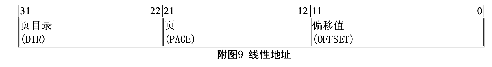
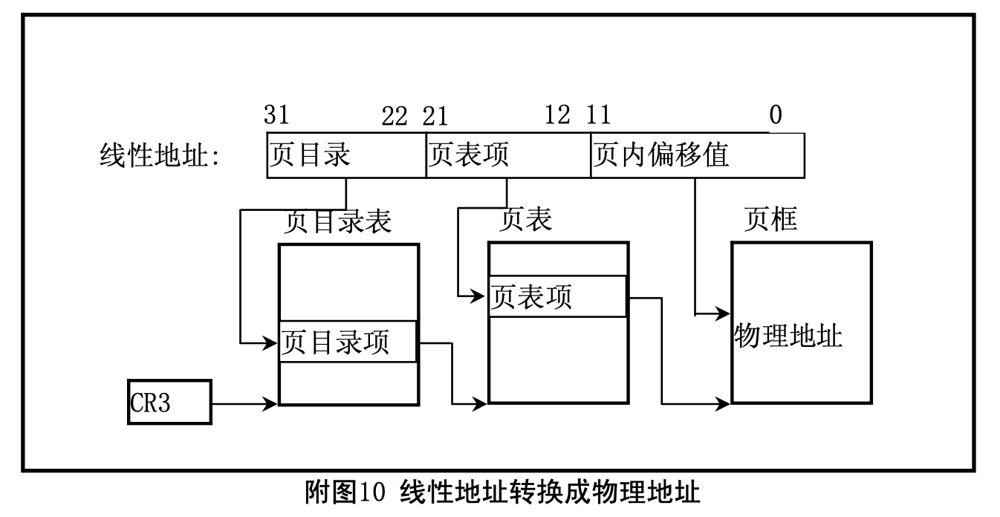
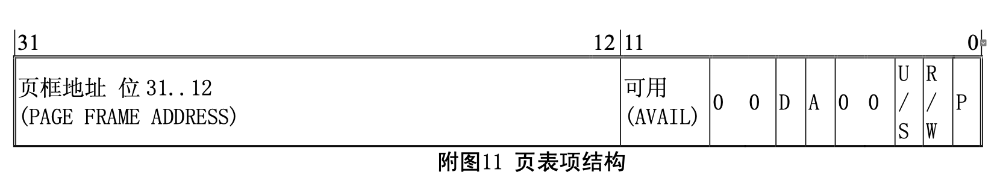

#0.内存管理
内存管理主要涉及处理器的内存寻址机制。80x86 使用两步将一个分段形式的逻辑地址转换为实际物
理内存地址。
• 段变换，将一个由段选择符和段内偏移构成的逻辑地址转换为一个线性地址; • 页变换，将线性地址转换为对应的物理地址。该步是可选的。
在分页机制开启时，通过将前面所述的段转换和页转换组合在一起，即实现了从逻辑地址到物理地址 的两个转换阶段。

#1.段变换
下图示出了处理器是如何将一个逻辑地址转换为线性地址的。在转换过程中 CPU 使用了以下一些数据 结构:
• 段描述符(Segment Descriptors);
• 描述符表(Descriptor tables);
• 选择符(Selectors);
• 段寄存器(Segment Registers)。

#2.页变换(翻译)
在地址变换的第二阶段，CPU 将线性地址转换为物理地址。地址变换的这个阶段实现了基于分页的虚
拟内存系统和分页级保护的基􏰀功能。页变化这一步是可选的，页变换仅在设置了 CR0 的 PG 比特位后才 起作用，该比特位是在软件初始化时由操作系统设置的。如果操作系统需要实现多个虚拟 8086 任务、基 于分页的保护机制或基于分页的虚拟内存，那么就一定要设置该位。
##2.1 页框(帧)(Page Frame)
页框是一个物理内存地址连续的 4K 字节单元。它以字节为边界，大小固定。
##2.2 线性地址(Linear Address)
线性地址通过指定一个页表、页表中的某一页以及该页中的偏移值，从而间接地指向对应的物理地址。 下图示出了线性地址的格式。

下图示出了处理器将一个线性地址转换成物理地址的方法。通过使用两级页表，处理器将一个线性地 址的页目录字段(DIR)、页字段(PAGE)和偏移字段(OFFSET)翻译成对应的物理地址。寻址机制使用线性地 址的页目录字段作为页目录中的索引值、使用页表字段作为页目录所指定页表中的索引值、使用偏移字段 作为页表所确定的内存页中的字节偏移值。

##2.3 页表(Page Table)
页表只是一个简单的 32 位页指示器的数组。页表􏰀身也是一页内存，因此它􏰂有 4K 字节的内存，可
容纳1K个32位的项。

这里使用了两级页表来定位一页内存页。最高层是页目录，页目录可定位最多 1K 个第二级页表，而每个二级页表可以定位最多 1K 内存页。因此，一个页目录定位的所有页表可以寻址 1M 内存页(220)。由 于每一页内存􏰂有 4K 字节(212)，最终一个页目录所指定的页表可以寻址 80386 的整个物理地址空间(220
* 212 = 232)。

当前页目录的物理地址是存储在 CPU 控制寄存器 CR3 中的，因此该寄存器也被称为页目录基地址寄 存器(page directory base register – PDBR)。内存管理软件可以选择对所有的任务只使用一个页目录，或每 个任务使用一个页目录，也可以组合两个任务使用一个页目录。

##2.4 页表项(Page-Table Entries)
各级页表所使用的页表项是相同的，其格式见下图所示。

其中，页框地址(PAGE FRAME ADDRESS)指定了一页内存的物理起始地址。因为内存页是位于 4K 边 界上的，所以其低 12 比特总是 0。在一个页目录中，页表项的页框地址是一个页表的起始地址;在第二级 页表中，页表项的页框地址是包􏰂期望内存操作的页框的地址。

存在位(PRESENT – P)确定了一个页表项是否可以用于地址转换过程。P=1 表示该项可用。当目录 表项或第二级表项的 P=0 时，则该表项时无效的，不能用于地址转换过程。此时该表项的其它所有比特位 都可供程序使用;处理器不对这些位进行测试。

当 CPU 试图使用一个页表项进行地址转换时，如果此时任意一级页表项的 P=0，则处理器就会发出页 异常信号。对于支持分页虚拟内存的软件系统中，页不存在(page-not-present)异常处理程序就可以把所请求 的页加入到物理内存中。此时导致异常的指令就可以被重新执行。

已访问(Accessed – A)和已修改(Dirty – D)比特位提供了有关页使用的信息。除了页目录项中的已 修改位，这些比特位将由硬件置位，但不复位。

在对一页内存进行读或写操作之前，处理器将设置相关的目录和二级页表项的已访问位。在向一个二 级页表项所涵盖的地址进行写操作之前，处理器将设置该二级页表项的已修改位，而页目录项中的已修改 位是不用的。当需求的内存超出实际物理内存量时，支持分页虚拟内存的操作系统可以使用这些位来确定 那些页可以从内存中取走。操作系统必须负责检测和复位这些比特位。

读/写位(Read/Write – R/W)和用户/超级用户位(User/Supervisor – U/S)并不用于地址转换，但用于 分页级的保护机制，是由处理器在地址转换过程中同时操作的。

##2.5 页转换高速缓冲
为了最大地提高地址转换的效率，处理器将最近所使用的页表数据存放在芯片上的高速缓冲中。操作 系统设计人员必须在当前页表改变时刷新高速缓冲，可使用以下两种方式之一:

1. 通过使用 MOV 指令重新加载 CR3 页目录基址寄存器; 
2. 通过执行一个任务切换。

