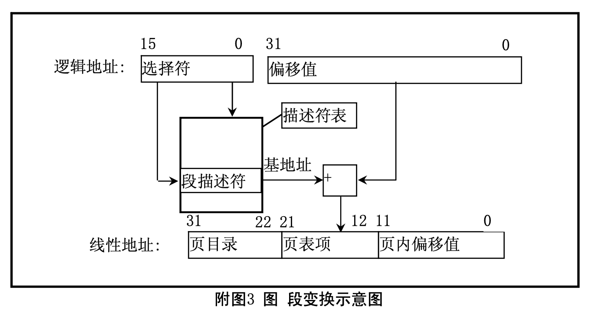

#1. 内存管理
内存管理主要涉及处理器的内存寻址机制。80x86 使用两步将一个分段形式的逻辑地址转换为实际物
理内存地址。
• 段变换，将一个由段选择符和段内偏移构成的逻辑地址转换为一个线性地址; • 页变换，将线性地址转换为对应的物理地址。该步是可选的。
在分页机制开启时，通过将前面所述的段转换和页转换组合在一起，即实现了从逻辑地址到物理地址 的两个转换阶段。

#2 段变换
下图示出了处理器是如何将一个逻辑地址转换为线性地址的。在转换过程中 CPU 使用了以下一些数据 结构:
• 段描述符(Segment Descriptors);
• 描述符表(Descriptor tables);
• 选择符(Selectors);
• 段寄存器(Segment Registers)。

