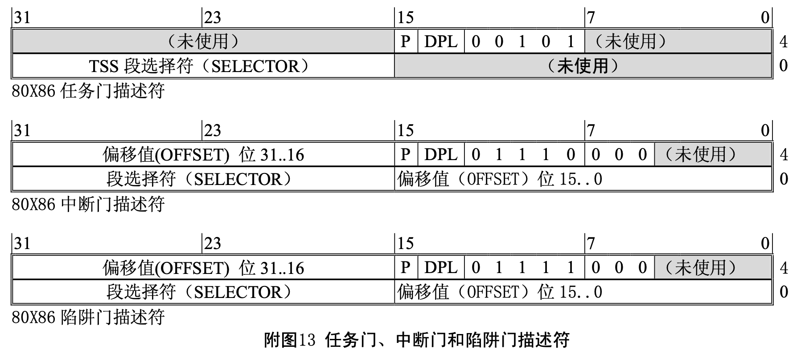

#1.INT——中断


* 根据CPU说明书，从0x00到0x1f都是异常所使用的中断，IRQ的中断号从0x20开始。
* INT 0x00：除0异常
* INT 0x06：非法指令异常。
	* 当试图执行CPU无法理解的机器语言指令，例如当试图执行一段数据时。

* INT 0x0c：栈异常中断
* INT 0x0d ——异常
要想强制结束程序，只要在中断号0x0d中注册一个函数即可，这是因为在x86架构规范中，当应用程序试图破坏OS的时候，就会产生0x0d中断，因此该中断也称为异常。

* INT 0x10——调用显卡BIOS
是由 BIOS 对屏幕及显示器所提供的服务程序
	* AH:0x00 :设置显卡模式。AL指定模式。
		* AL=0x13：VGA显卡，320* 200*8位彩色
		* AL=0x03：16色字符模式，80*25。
		* AL=0x12：VGA图形模式，640* 480*4位彩色模式，独特的4面存储模式。
		* AL=0x6a：扩展VGA模式，800* 600*4位彩色模式，独特的4面存储模式。
	* AH:0x0e ：显示一个文字。BX指定文字颜色。


* (2)INT 0x13——磁盘读写，扇区校验(verify)，以及寻道(seek)。具体参数查阅百度
AH:0x00 :系统复位
AH:0x02 :读盘
AH:0x03 :写盘
AH:0x04 :校验
AH:0x0c :寻道

* (3)INT 0x16

		; 用BIOS取得键盘上各种LED指示灯的状态。
		MOV AH, 0x02
		INT 0x16
		MOV [LEDS], AL
	
* INT 0x20：定时器
* (4)INT 0x21
	* 键盘
* (5)INT 0x27
	* 鼠标
* (6)INT 0x2c
	* 鼠标

#2.BIOS中断和DOS中断的区别

bios是主板预装好的input、output系统，而dos是需要安装才能使用操作系统。用int条用中断以后可以通过不同的系统达到不同的目的和效果。其中int 1 -20 是bios中断，int21 专门用于dos中断。
只有16位汇编才能访问BIOS，32位汇编不能访问。

电脑里有个名为BIOS的程序，出厂时就组装在电脑主板上的ROM单元里。电脑厂家在BIOS里预先写入了操作系统开发人员经常会用到的一些程序。

最近的BIOS功能非常多，设置包括了电脑的设定画面，不过它的本质正如其名，就是操作系统开发人员准备的各种函数的集合。而INT就是用来调用这些函数的指令。
INT后面是个数字，不同的数字可以调用不同的函数。这次我们调用的是0x10(即16)号函数，它的功能是控制显卡。

#3.CLI STI
CLI：将中断标志（interrupt flag）置为0的指令（clear interrupt flag）。
STI：是要将这个终端标志置为1的指令（set interrupt flag）。

#4.IDT
IDT是“interrupt descriptor table”的缩写，直译过来就是“中断记录表”。当CPU遇到外部状况变化，或者是内部偶然发生某些错误时，会临时切花过去处理这种突发事件。这就是中断功能。

IDT记录了0~255的中断号码和调用函数的对应关系。

中断本质上将是为了解决CPU和外部慢设备之间的问题。避免了CPU轮询的低效。

各个设备有变化时，就产生中断，中断发生后，CPU暂时停止正在处理的任务，并做好接下来继续处理的准备，转而执行中断程序。中断程序执行完后，再调用事先设定好的函数，返回处理中的任务。
正是得益于中断机制，CPU可以不用一直查询键盘、鼠标、网卡等设备的状态，将精力集中在处理任务上。

要使用鼠标，就不许使用中断。所以，我们必须设定IDT，IDT记录了0~255的中断号码于调用函数的对应关系，比如说发生了123号中断，就调用handler123()函数，其设定方法于GDT很类似。

#5.中断处理函数的栈信息(doll)
##5.1 异常中断处理汇编函数
```
_asm_inthandler0c:
        STI
        PUSH    ES
        PUSH    DS
        PUSHAD
        MOV     EAX,ESP
        PUSH    EAX
        MOV     AX,SS
        MOV     DS,AX
        MOV     ES,AX
        CALL    _inthandler0c
        CMP     EAX,0
        JNE     _asm_end_app
        POP     EAX
        POPAD
        POP     DS
        POP     ES
        ADD     ESP,4           ; 在INT 0x0c中也需要这句
        IRETD
```

##5.2 异常中断C语言处理函数
```cpp
int *inthandler0c(int *esp)
{
    struct CONSOLE *cons = (struct CONSOLE *) *((int *) 0x0fec);
    struct TASK *task = task_now();
    char s[30];
    cons_putstr0(cons, "\nINT 0C :\n Stack Exception.\n");
    sprintf(s, "EIP = %08X\n", esp[11]);
    cons_putstr0(cons, s);
    return &(task->tss.esp0); /*强制结束程序*/
}
```
##5.3 C调用栈信息
esp[0]	:	EDI
esp[1]	:	ESI
esp[2]	:	EBP
esp[3]	:	ESP
esp[4]	:	EBX
esp[5]	:	EDX
esp[6]	:	ECX
esp[7]	:	EAX

-----------------------//以上为PUSHAD的结果
esp[8]	:	DS
esp[9]	:	ES

-----------------------//以上是PUSH ES, PUSH DS
esp[10]	:	错误编号（一般是0，显示出来也没什么意思）
esp[11]	:	EIP
esp[12]	:	CS
esp[13]	:	EFLAGS
esp[14]	:	ESP（应用程序APP ESP）
esp[15]	:	SS（应用程序APP SS）

----------------------//以上为异常产生时，CPU自动PUSH的结果

#6.中断和异常
中断和异常是一种特殊类型的控制转换。它们改变了正常程序流而去处理其它的事件(例如外部事件、出错报告或异常条件)。中断与异常的主要区别在于中断常用于处理 CPU 外部的异步事件，而异常则是处 理 CPU 在执行过程中􏰀身检测到的问题。

外部中断源有两种:由 CPU 的 INTR 引脚输入的可屏蔽中断和 NMI 引脚输入的不可屏蔽中断。同样， 异常也有两类:由 CPU 检测到的出错、陷阱或放弃事件以及编程设置的“软中断”(如 INT 3 指令等)。

处理器使用标识号(中断号)来识别每种类型的中断或异常。处理器所能识别的不可屏蔽中断 NMI 和异常的标识号是预先确定的，范围是 0 到 31(0x00-0x1f)。目前这些号码并没有全都使用，未确定的号 码由 Intel 公司留作今后使用。

可屏蔽中断的标识号由外部中断控制器(如 8259A 可编程中断控制器)确定，并在 CPU 的中断识别 阶段通知CPU。8259A所分配的中断号可以通过编程指定，可使用的标识号范围是32到255(0x20-0xff)。 Linux 系统将 32-47 分配给了可屏蔽中断，余下的 48-255 用来标识其它软中断。当 Linux 只使用了号码 128(0x80)作为系统调用的中断向量号。

##6.1 中断描述符表
中断描述符表(Interrupt Descriptor Table – IDT)将每个中断或异常标识号与处理相应事件程序指令的 一个描述符相关联。与 GDT 和 LDT 相似，IDT 是一个 8 字节描述符数组，但其第 1 项可以􏰂有一个描述 符。处理器通过将中断号异常号乘上 8 即可索引 IDT 中对应的描述符。IDT 可以位于物理内存的任何地方。 处理器是使用 IDT 寄存器(IDTR)来定位 IDT 的。修改和复制 IDT 的指令是 LIDT 和 SIDT。与 GDT 表 的操作一样，IDT 也是使用 6 字节数据的内存地址作为操作数的。前两个字节表示表的限长，后 4 个字节 是表的线性基地址。
##6.2 IDT 描述符
在中断描述符表 IDT 中可以􏰂有三类描述符中的任意一种:

* •  任务门(Task gates);
* •  中断门(Interrupt gates);
* •  陷阱门(Trap gates); 

下图给出了任务门、中断门和陷阱门描述符的格式。


##6.3 中断任务和中断过程
正如 CALL 指令能调用一个过程或任务一样，一个中断或异常也能“调用”中断处理程序，该程序是一个过程或一个任务。当响应一个中断或异常时，CPU 使用中断或异常的标识号来索引 IDT 表中的描述符。 如果 CPU 索引到一个中断门或陷阱门时，它就调用处理过程;如果是一个任务门，它就引起任务切换。

中断门或陷阱门间接地指向一个过程，该过程将在当前执行任务上下文中执行。门描述符中的段选择 符指向 GDT 或当前 LDT 中的一个可执行段的描述符。门描述符中的偏移字段值指向中断或异常处理过程 的开始处。

80X86 执行一个中断或异常处理过程的方式与 CALL 指令调用一个过程的方式非常相似，只是两者在 使用堆栈上略有不同。中断会在把原指令指针压入堆栈之前，把原标志寄存器 EFLAGS 的内容也推入堆栈 中。对于与段有关的异常，CPU 还会将一个错误码压入异常处理程序的堆栈上。

对于中断过程处理结束的返回操作，中断返回指令 IRET 与 RET 相似，但是 IRET 为了去除压入堆栈 的 EFLAGS 值，ESP 会多递增 4 个字节。

中断门与陷阱门的区别在于对中断允许标志 IF 的影响。由中断门向量引起的中断会复位 IF，因为可 以避免其它中断干扰当前中断的处理。随后的 IRET 指令会从堆栈上恢复 IF 的原值;而通过陷阱门产生的 中断不会改变 IF。

IDT 表中的任务门描述符间接地指向一个任务状态段 TSS。任务门描述符中的段选择符指向 GDT 表 中的一个 TSS 描述符。当产生的中断或异常指向 IDT 中的一个任务门描述符，就会导致任务切换，从而会 在独立的任务中处理中断。Linux 系统中并没有使用任务门描述符。


