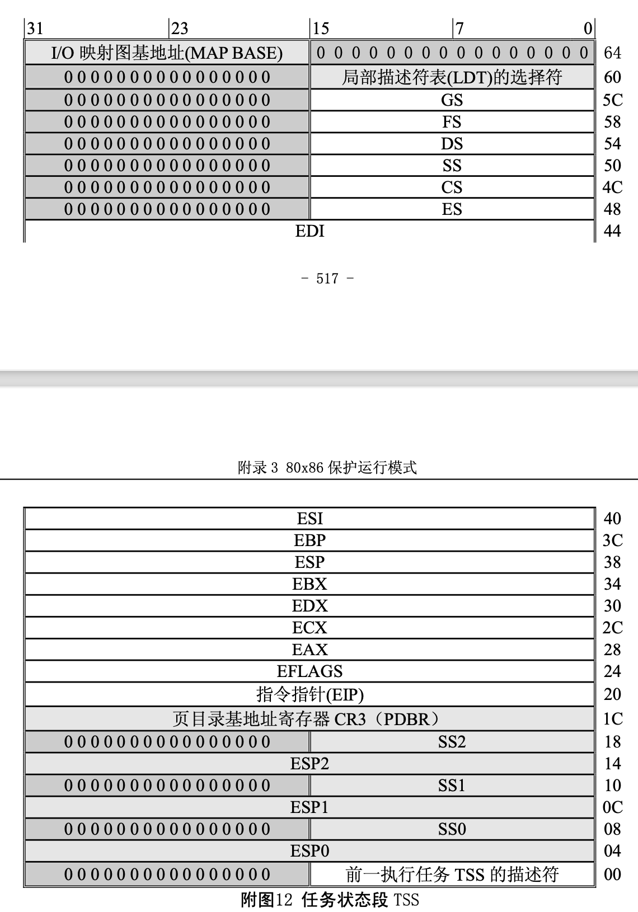

#1.多任务（Multitasking）

为了提供有效的、受保护的多任务机制，80x86 使用了一些特殊的数据结构。支持多任务运行的寄存器和数据结构主要有任务状态段(Task State Segment)和任务寄存器(Task register)。使用这些数据结构， CPU 可以快速地从一个任务的执行切换到另一个任务，并保存原有任务的内容。

##3.1 任务状态段(Task State Segment – TSS)

处理器管理一个任务的所有信息存储在一个特殊类型的段中，即任务状态段 TSS。下图给出了 TSS 的 格式。其中的字段可分为两类:

•  处理器只读其中信息的静态字段集(图中灰色部分); 

•  每次任务切换时处理器将会更新的动态字段集。

任务状态段 TSS 可以处于线性空间的任何位置。TSS 与其它段一样，也是使用段描述符来定义的。访 问 TSS 的描述符会导致任务切换。因此，在大多数系统中都将描述符的 DPL(描述符特权级)字段设置为 最高特权级 0，这样就可以只允许可信任的软件执行任务的切换。TSS 的描述符只能放在全局描述符表 GDT 中。

##3.2 任务寄存器
任务寄存器(Task Register – TR)的作用与一般段寄存器的类似，它通过指向 TSS 来确定当前执行的 任务。它也有 16 位的可见部分和不可见部分。可见部分中的选择符用于在 GDT 表中选择一个 TSS 描述符， 处理器使用不可见部分来存放描述符中的基地址和段限长值。指令 LTR 和 STR 用于修改和读取任务寄存 器中的可见部分，指令所使用的操作数是一 16 位的选择符。

另外，还有一种提供对 TSS 间接、受保护引用的任务门描述符(Task Gete Descriptor)。这种描述符是 在一般段描述符格式的基地址位 15..0 字段(第 3、4 字节)中存放的是一个 TSS 描述符的选择符，并利用其 中的特权级字段(DPL)来控制使用描述符执行任务切换的权限。见下面有关中断描述符表 IDT 描述符中的 说明。

在以下 4 种情况下，CPU 会切换执行的任务:

* 1. 当前任务执行了一条引用 TSS 描述符的 JMP 或 CALL 指令;
* 2. 当前任务执行了一条引用任务门的 JMP 或 CALL 指令;
* 3. 引用了中断描述符表(IDT)中任务门的中断或异常;
* 4. 当嵌套任务标志 NT 置位时，当前任务执行了一个 IRET 指令。

